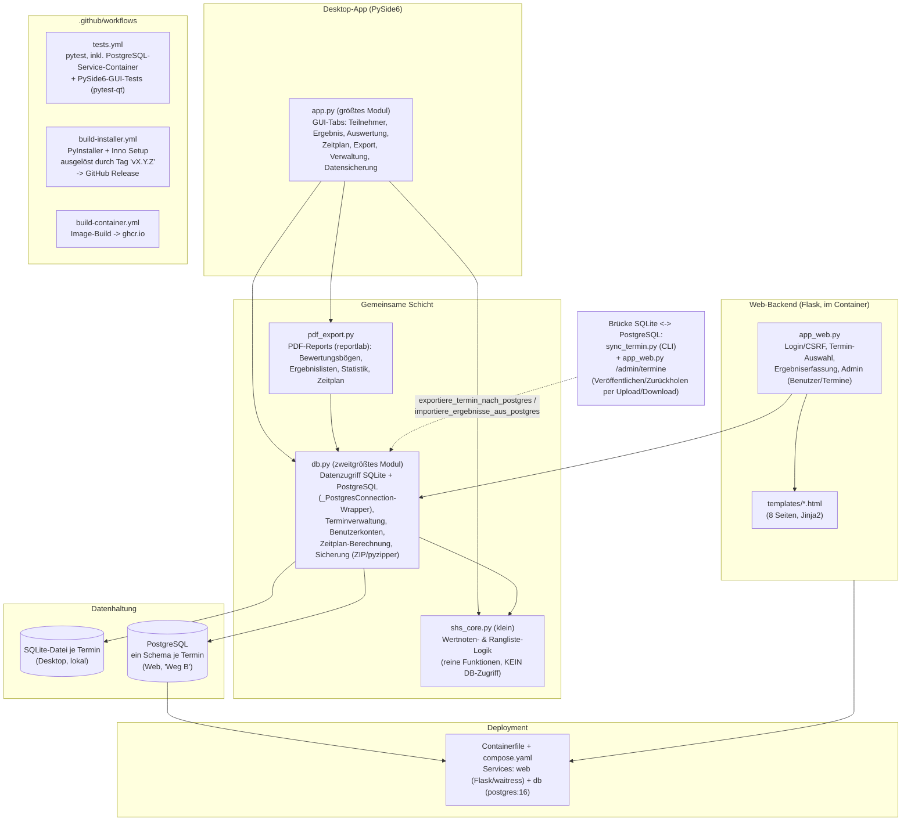

# Architekturüberblick: SHS-Prüfungsprogramm

Stand: 20.09.2026 (Modul-/Testübersicht aktualisiert 22.09.2026). Ergänzt `Grobkonzept.md` (ursprünglicher Migrationsplan, Stand 10.09.) um den
aktuellen, tatsächlich umgesetzten Stand inkl. der später hinzugekommenen Web/PostgreSQL-Variante.
Gedacht als schneller Einstieg für neue Sitzungen/Subagents, die den Code noch nicht kennen -
Details und Historie einzelner Entscheidungen stehen weiterhin in `Fortschritt.md`.

## 1. Zwei Laufzeitumgebungen, eine gemeinsame Datenschicht

Das Programm existiert in zwei parallelen Frontends, die auf denselben Fachfunktionen aufsetzen:

- **Desktop-App** (`app.py`, PySide6) - läuft lokal bei der Prüfungsleitung, eine Person,
  eine SQLite-Datei je Termin (`termine_ordner()`), volle Funktionalität (Termin anlegen,
  Teilnehmer, Ergebnisse, Zeitplan, PDF-Ausgabe, Datensicherung).
- **Web-Backend** (`app_web.py`, Flask) - läuft im Container am Prüfungstag, mehrere Richter
  gleichzeitig, NUR Ergebniserfassung (bewusst eingeschränkter Umfang, siehe Modul-Docstring
  dort). Datenhaltung in PostgreSQL, ein Schema je Termin ("Weg B").

Beide Frontends rufen dieselben Funktionen in `db.py`/`shs_core.py`/`pdf_export.py` auf - die
Fachlogik (Wertnoten, Rangliste, Migrationen) existiert nur EINMAL, nicht getrennt für
SQLite und PostgreSQL.

## 2. Modultabelle

| Datei | Zweck | Zugehöriger Test |
|---|---|---|
| `app.py` | Desktop-GUI (PySide6): alle Tabs/Dialoge, `closeEvent`-Handling, Auto-Save, Darstellung (Hintergrund-Designs `_DESIGNS` × Akzentfarben `_THEMES` → `_erzeuge_qss()`, angewendet über `_darstellung_anwenden()` inkl. Palette/Fusion für Dunkel; Farben im Code über `_farbe()`) | `test_app_gui.py`, `test_theme.py` (Stylesheet-Erzeugung + WCAG-Kontrast; braucht ebenfalls PySide6) |
| `app_web.py` | Flask-Web-Backend: Login/Session/CSRF, Termin-Auswahl, Ergebniserfassung, Admin-Benutzer- und Termin-Verwaltung | `test_app_web.py` |
| `db.py` | Datenzugriffsschicht für BEIDE Backends: Schema, Migrationen, Terminverwaltung (SQLite + PostgreSQL), Benutzerkonten, Zeitplan-Berechnung, Backup/Restore (ZIP, optional `pyzipper`-verschlüsselt) | `test_db.py`, `test_db_postgres_wrapper.py`, `test_backup.py` (Datensicherung ZIP/pyzipper) |
| `shs_core.py` | Reine Fachlogik ohne DB-Zugriff: Wertnoten-Berechnung (ED/DK), Rangliste-Bildung | `test_shs_core.py` |
| `pdf_export.py` | PDF-Erzeugung (reportlab): Bewertungsbögen, Ergebnislisten, Etiketten, Statistik, Zeitplan, Richter-Bedarf | `test_pdf_export.py` |
| `sync_termin.py` | CLI-Alternative zum Web-Upload/Download: Termin per Kommandozeile veröffentlichen/zurückholen (für Automatisierung/Skripte) | (über `db.py`-Tests abgedeckt) |
| `bump_version.py` | Versionsnummer (`version.txt`/`version_info.txt`/`version.py`) für Releases hochzählen | `test_bump_version.py` |
| `templates/*.html` | Jinja2-Templates für `app_web.py` (Login, Ersteinrichtung, Termin-/Benutzerverwaltung, Ergebniserfassung) | (über `test_app_web.py` abgedeckt) |
| `Containerfile`, `compose.yaml` | Container-Image + lokales Podman/Docker-Compose-Setup für die Web-Variante | `.github/workflows/build-container.yml` |
| `installer.iss`, `build.spec` | Windows-Installer (Inno Setup) bzw. PyInstaller-Bundling für die Desktop-Variante | `.github/workflows/build-installer.yml` |

## 3. Wichtige Architekturentscheidungen (Kurzfassung - Details in `Fortschritt.md`)

- **"Weg B" (Schema-pro-Termin) statt eigener Datenbank je Termin**: alle Termine teilen sich
  eine PostgreSQL-Datenbank, aber je Termin ein eigenes Schema (`_setze_termin_suchpfad`,
  `SET search_path`) - hält Termine voneinander isoliert, ohne für jeden Termin eine neue
  Datenbank anzulegen.
- **`_PostgresConnection`/`_PostgresCursor`**: bildet die `sqlite3.Connection`-Schnittstelle für
  PostgreSQL nach (`?`→`%s`-Übersetzung, automatisches `RETURNING id`, `lastrowid`-Emulation) -
  dadurch kann `db.py`s übrige Fachlogik unverändert auf beiden Backends laufen, ohne
  Verzweigungen im Code für "welche Datenbank".
- **Web-Umfang bewusst eng gehalten**: nur Ergebniserfassung + Admin (Benutzer/Termine).
  Termin anlegen, Teilnehmerverwaltung, Zeitplan, PDF-Export bleiben Desktop-Aufgaben.
- **Benutzerkonten statt gemeinsamem Zugangscode**: zwei Rollen (Administrator, "Nur
  Eintragen"), global über alle Termine (nicht mehr an einen einzelnen Termin gebunden).
- **Datei-Upload/Download statt direktem Dateizugriff des Containers**: funktioniert
  unabhängig davon, ob Container und Desktop-App auf demselben Gerät laufen.

## 4. Test-Suite-Struktur

Mindestens ein Testmodul je Kern-Modul (Zuordnung in der Tabelle oben - nicht 1:1: `db.py`
hat drei Testmodule, `app.py` zwei, `sync_termin.py` und `templates/` keine eigenen), plus
Besonderheiten:

- **PostgreSQL-Tests** (`Test*Postgres`-Klassen in `test_db.py`, `TestCsrfSchutz`-unabhängige
  Postgres-Fälle) brauchen `SHS_TEST_POSTGRES_DSN` + `psycopg2` - laufen nur in der CI
  (Service-Container in `tests.yml`), werden lokal übersprungen (`skipTest`).
- **GUI-Tests** (`test_app_gui.py`) brauchen PySide6 + `pytest-qt` - ebenfalls nur in der CI;
  `test_theme.py` braucht PySide6 (importiert `app`).
- **PDF-Inhaltstests** (`test_pdf_export.py`) brauchen `pypdf` - ohne pypdf wird der Großteil
  übersprungen. Test-/Dev-Abhängigkeiten stehen in `requirements-dev.txt`.
- **`test_app_web.py`** mockt die PostgreSQL-Klebefunktionen und läuft stattdessen echt gegen
  eine temporäre SQLite-Datei - dadurch überall lauffähig, ohne PostgreSQL zu brauchen.
- Lokale Verifikation (ohne PySide6/psycopg2/pytest): `python3 -m unittest test_db
  test_db_postgres_wrapper test_backup test_pdf_export test_app_web test_bump_version
  test_shs_core` deckt alles außer GUI- und echten Postgres-Tests ab.

## 5. Woher kommt was (Verweise)

- Fachlicher Hintergrund/Migrationsplan: `Grobkonzept.md`
- Vollständige Entscheidungs-/Fix-Historie, offene Punkte: `Fortschritt.md`
- Web-Deployment im Detail: `README_CONTAINER.md`
- Installer/Signierung im Detail: `README_INSTALLER.md`, `CODE_SIGNING_POLICY.md`

## 6. Arbeitsweise mit Subagents (mit dem Nutzer am 20.09.2026 abgestimmt)

Kurzfassung - die vollständige, für jede Sitzung geltende Fassung steht in `CLAUDE.md` im
Repo-Wurzelverzeichnis (wird von Claude-Sitzungen, die in diesem Ordner arbeiten, automatisch
gelesen):

1. **Explore-Subagent vor neuen, nicht-trivialen Aufgaben** - statt `app.py` oder `db.py` (die beiden
   mit Abstand größten Module, mehrere tausend Zeilen) komplett zu lesen, zuerst einen schnellen Such-Subagent die relevante
   Stelle lokalisieren lassen.
2. **Bereichs-Subagents bei bereichsübergreifenden Änderungen** - betrifft eine Änderung
   mehrere der drei Bereiche Desktop (`app.py`), Web (`app_web.py`+`templates/`) und Daten
   (`db.py`), parallele Subagents je Bereich statt sequenziell.
3. **Differenzierte QS-Rollen statt identischer Aufträge** - die monatliche QS-Prüfung
   (Scheduled Task) gibt den 3 Subagents jetzt unterschiedliche Schwerpunkte: Sicherheit /
   Korrektheit & Edge-Cases / Wartbarkeit & Stil - statt 3x denselben allgemeinen Auftrag.
4. **Unabhängiger Verifikations-Subagent nach der Umsetzung** - vor der Fertigmeldung prüft ein
   separater Subagent Diff und Tests gegen, zusätzlich zum eigenen Testlauf - vor allem bei
   sicherheitsrelevanten Änderungen.

Nimmt keiner dieser Subagents selbst Code-Änderungen an bereits abgeschlossenen, vom Nutzer
freigegebenen Ständen vor - der etablierte Prozess (jeder Befund wird einzeln besprochen, erst
nach explizitem Go umgesetzt) gilt unverändert.
