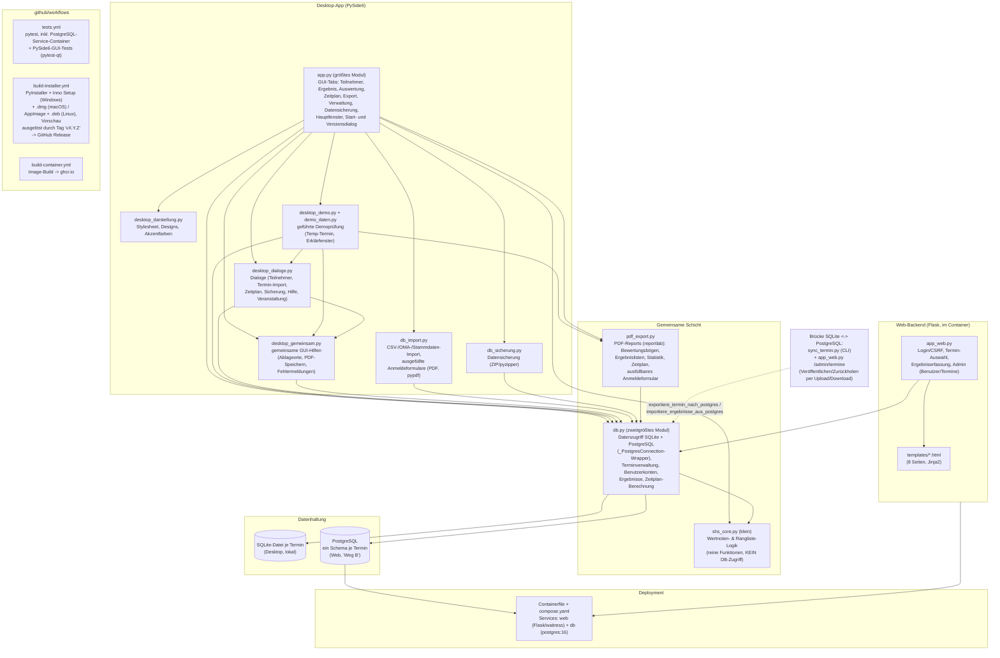

# Architekturüberblick: SHS-Prüfungsprogramm

Stand: 20.09.2026 (Modul-/Testübersicht aktualisiert 22.09.2026, Modulaufteilung 27.09.2026, Anmeldeformular 28.09.2026, UX-Test-Umsetzung 03.10.2026). Ergänzt `Grobkonzept.md` (ursprünglicher Migrationsplan, Stand 10.09.) um den
aktuellen, tatsächlich umgesetzten Stand inkl. der später hinzugekommenen Web/PostgreSQL-Variante.
Gedacht als schneller Einstieg für neue Sitzungen/Subagents, die den Code noch nicht kennen -
Details und Historie einzelner Entscheidungen stehen weiterhin in `Fortschritt.md`.

## 1. Zwei Laufzeitumgebungen, eine gemeinsame Datenschicht

Das Programm existiert in zwei parallelen Frontends, die auf denselben Fachfunktionen aufsetzen:

- **Desktop-App** (`app.py` + `desktop_*.py`, PySide6) - läuft lokal bei der Prüfungsleitung, eine Person,
  eine SQLite-Datei je Termin (`termine_ordner()`), volle Funktionalität (Termin anlegen,
  Teilnehmer, Ergebnisse, Zeitplan, PDF-Ausgabe, Datensicherung).
- **Web-Backend** (`app_web.py`, Flask) - läuft im Container am Prüfungstag, mehrere Richter
  gleichzeitig, NUR Ergebniserfassung (bewusst eingeschränkter Umfang, siehe Modul-Docstring
  dort). Datenhaltung in PostgreSQL, ein Schema je Termin ("Weg B").

Beide Frontends rufen dieselben Funktionen in `db.py`/`shs_core.py`/`pdf_export.py` auf - die
Fachlogik (Wertnoten, Rangliste, Migrationen) existiert nur EINMAL, nicht getrennt für
SQLite und PostgreSQL.

```mermaid
flowchart TB
    subgraph Desktop["Desktop-App (PySide6)"]
        AppPy["app.py (größtes Modul)<br/>GUI-Tabs: Teilnehmer, Ergebnis, Auswertung,<br/>Zeitplan, Export, Verwaltung, Datensicherung,<br/>Hauptfenster, Start- und Versionsdialog"]
        DeskDialoge["desktop_dialoge.py<br/>Dialoge (Teilnehmer, Termin-Import,<br/>Zeitplan, Sicherung, Hilfe, Veranstaltung)"]
        DeskGemeinsam["desktop_gemeinsam.py<br/>gemeinsame GUI-Hilfen<br/>(Ablageorte, PDF-Speichern, Fehlermeldungen)"]
        DeskDarstellung["desktop_darstellung.py<br/>Stylesheet, Designs, Akzentfarben"]
        DeskDemo["desktop_demo.py + demo_daten.py<br/>geführte Demoprüfung<br/>(Temp-Termin, Erklärfenster)"]
        DbImport["db_import.py<br/>CSV-/OMA-/Stammdaten-Import,<br/>ausgefüllte Anmeldeformulare (PDF, pypdf)"]
        DbSicherung["db_sicherung.py<br/>Datensicherung (ZIP/pyzipper)"]
    end

    subgraph WebBackend["Web-Backend (Flask, im Container)"]
        AppWeb["app_web.py<br/>Login/CSRF, Termin-Auswahl,<br/>Ergebniserfassung, Admin (Benutzer/Termine)"]
        Templates["templates/*.html<br/>(8 Seiten, Jinja2)"]
    end

    subgraph Shared["Gemeinsame Schicht"]
        DbPy["db.py (zweitgrößtes Modul)<br/>Datenzugriff SQLite + PostgreSQL<br/>(_PostgresConnection-Wrapper),<br/>Terminverwaltung, Benutzerkonten,<br/>Ergebnisse, Zeitplan-Berechnung"]
        ShsCore["shs_core.py (klein)<br/>Wertnoten- &amp; Rangliste-Logik<br/>(reine Funktionen, KEIN DB-Zugriff)"]
        PdfExport["pdf_export.py<br/>PDF-Reports (reportlab): Bewertungsbögen,<br/>Ergebnislisten, Statistik, Zeitplan,<br/>ausfüllbares Anmeldeformular"]
    end

    subgraph Stores["Datenhaltung"]
        Sqlite[("SQLite-Datei je Termin<br/>(Desktop, lokal)")]
        Postgres[("PostgreSQL<br/>ein Schema je Termin<br/>(Web, 'Weg B')")]
    end

    Sync["Brücke SQLite &lt;-&gt; PostgreSQL:<br/>sync_termin.py (CLI)<br/>+ app_web.py /admin/termine<br/>(Veröffentlichen/Zurückholen per Upload/Download)"]

    AppPy --> DbPy
    AppPy --> DeskDialoge
    AppPy --> DeskGemeinsam
    AppPy --> DeskDarstellung
    AppPy --> DbImport
    AppPy --> DbSicherung
    AppPy --> DeskDemo
    DeskDemo --> DeskDialoge
    DeskDemo --> DeskGemeinsam
    DeskDemo --> PdfExport
    DeskDemo --> DbPy
    DeskDialoge --> DeskGemeinsam
    DeskDialoge --> DbPy
    DeskGemeinsam --> DbPy
    DbImport --> DbPy
    DbSicherung --> DbPy
    AppPy --> ShsCore
    AppPy --> PdfExport
    AppWeb --> DbPy
    AppWeb --> Templates
    DbPy --> ShsCore
    PdfExport --> DbPy
    DbPy --> Sqlite
    DbPy --> Postgres
    Sync -.exportiere_termin_nach_postgres /<br/>importiere_ergebnisse_aus_postgres.-> DbPy

    subgraph Deploy["Deployment"]
        Container["Containerfile + compose.yaml<br/>Services: web (Flask/waitress) + db (postgres:16)"]
    end
    subgraph CI[".github/workflows"]
        Tests["tests.yml<br/>pytest, inkl. PostgreSQL-Service-Container<br/>+ PySide6-GUI-Tests (pytest-qt)"]
        Installer["build-installer.yml<br/>PyInstaller + Inno Setup (Windows)<br/>+ .dmg (macOS) / AppImage + .deb (Linux), Vorschau<br/>ausgelöst durch Tag 'vX.Y.Z'<br/>-> GitHub Release"]
        ContainerBuild["build-container.yml<br/>Image-Build -> ghcr.io"]
    end

    WebBackend --> Container
    Postgres --> Container
```

## 2. Modultabelle

| Datei | Zweck | Zugehöriger Test |
|---|---|---|
| `app.py` | Desktop-GUI (PySide6): alle Tabs, `HauptFenster` (`closeEvent`-Handling, Auto-Save; Beenden durch Windows/Setup über `commitDataRequest` → `_sitzungsende_pruefen`, abgebrochenes Abmelden über `SitzungsendeFilter`, eingerichtet von `sitzungsende_einrichten`), `StartDialog`, `VersionDialog` + Update-Prüfung; `main()` lädt die deutschen Qt-Texte und richtet das Absturzprotokoll ein | `test_app_gui.py` |
| `desktop_dialoge.py` | Dialoge der Desktop-GUI (Teilnehmer, Startnummern tauschen, Termin-Import, Prüfungsblock/Pause, Bewertungsbogen-Auswahl, Sicherung erstellen, Hilfe, Veranstaltung); von `app.py` per `from … import` eingebunden | `test_app_gui.py` |
| `desktop_gemeinsam.py` | Gemeinsame GUI-Hilfen: Ablageorte/PDF-Speicherdialog (Ordner `Termine\Ausdrucke\<Termin>`, Meldung „gespeichert“ mit „PDF öffnen“/„Ordner zeigen“), Startordner der Importe, Fehlermeldungen, responsive Schriftgröße, Tabellen-Hilfsklassen, Spaltenkonstanten der Ergebnistabelle, deutsche Qt-Texte (`deutsche_qt_texte_laden`), Absturzprotokoll (`absturzprotokoll_einrichten`: `sys.excepthook` + `faulthandler` → `absturzprotokoll.txt`) | `test_app_gui.py` |
| `desktop_darstellung.py` | Darstellung: Hintergrund-Designs `_DESIGNS` × Akzentfarben `_THEMES` → `_erzeuge_qss()`, angewendet über `_darstellung_anwenden()` inkl. Palette/Fusion für Dunkel; Farben im Code über `_farbe()`; gespeicherte Auswahl (QSettings) | `test_theme.py` (Stylesheet-Erzeugung + WCAG-Kontrast; braucht PySide6), `test_app_gui.py` |
| `desktop_demo.py` | Geführte Demoprüfung (Button „🎓 Demoprüfung“ im Hauptfenster und im Startdialog): `DemoTour` legt einen Termin in einem eigenen Temp-Ordner an (nie im Termine-Ordner), führt 15 Schritte über die echten Reiter vor (ohne modale Rückfragen), `DemoPanel` erklärt, `DemoMarkierung` rahmt das aktive Element (selbst gezeichnet, kein Stylesheet); nach jedem fertigen Schritt automatisch weiter nach `DemoTour.AUTO_WEITER_S` Sekunden (abschaltbar; wartet bei offener Meldung, hält bei „PDF öffnen“ und eigener Eingabe im Demo-Dialog an); am Ende wird der vorherige Termin wiederhergestellt und der Temp-Ordner gelöscht. Importiert bewusst NICHT `app` (bekommt das Hauptfenster bzw. eine Fenster-Fabrik übergeben, sonst doppelter Import über `__main__`) | `test_app_gui.py` |
| `demo_daten.py` | Erfundene Daten der Demoprüfung (Veranstaltung, 8 Teilnehmer mit Ergebnissen: V/V-Stechen, SG, G, nB, DQ, 2× DK), ohne Qt | `test_db.py` (`TestDemoDaten`) |
| `app_web.py` | Flask-Web-Backend: Login/Session/CSRF, Termin-Auswahl, Ergebniserfassung, Admin-Benutzer- und Termin-Verwaltung; Geheimnisse über `geheimnis_lesen` (`<NAME>_FILE` vor `<NAME>`) | `test_app_web.py` |
| `db.py` | Datenzugriffsschicht für BEIDE Backends: Schema, Migrationen, Teilnehmer, Startnummern-Bereiche je Prüfung (`veranstaltung.startnummer_bereiche`, `fehlende_startnummern_vergeben`), Ergebnisse/Auswertung, Terminverwaltung (SQLite + PostgreSQL), Benutzerkonten, Zeitplan-Berechnung (automatische Verteilung mit DK-Mindestabstand, Überschneidungsprüfung `zeitplan_ueberschneidungen`, Pausen an Position bzw. bei allen Richtern, Richter aus den Veranstaltungsdaten), Sync SQLite↔PostgreSQL | `test_db.py`, `test_db_postgres_wrapper.py` |
| `db_import.py` | Teilnehmer-Import und -Export (Desktop): CSV (Excel-Liste oder KI; UTF-8/Windows-Kodierung, `;`/`,` erkannt, leere Vorlage), OMA-Meldeliste, ausgefüllte Anmeldeformulare (PDF-Formularfelder per `pypdf`, Laufzeitabhängigkeit seit 28.09.2026), Stammdaten aus einem anderen Termin; alle Wege prüfen die angebotenen Prüfungen (`_angebot_pruefen`); Teilnehmerliste als CSV-Export (`exportiere_teilnehmer_csv`, mit Schutz vor CSV-Formeln); baut auf `db.py` auf, `db.py` importiert es nicht | `test_db.py` |
| `db_sicherung.py` | Backup/Restore aller Termin-Dateien (ZIP, optional `pyzipper`-verschlüsselt); baut auf `db.py` auf | `test_backup.py` |
| `shs_core.py` | Reine Fachlogik ohne DB-Zugriff: Wertnoten-Berechnung (ED/DK), Rangliste-Bildung, Punktgrenzen `SUCHE_MAX`/`ANZEIGE_MAX` (gemeinsam für Desktop und Web) | `test_shs_core.py`, `test_bewertung_referenz.py` (mit Marco abgestimmte Referenzfälle + Eigenschaftstests mit `hypothesis`) |
| `pdf_export.py` | PDF-Erzeugung (reportlab): Bewertungsbögen, Ergebnislisten, Etiketten, Statistik, Zeitplan, Richter-Bedarf, ausfüllbares Anmeldeformular (Canvas + AcroForm; Feldnamen als Konstanten `ANMELDEFORMULAR_*` in `db.py`, gemeinsam mit dem Import) | `test_pdf_export.py` |
| `sync_termin.py` | CLI-Alternative zum Web-Upload/Download: Termin per Kommandozeile veröffentlichen/zurückholen (für Automatisierung/Skripte) | (über `db.py`-Tests abgedeckt) |
| `selbsttest.py` | `--selbsttest [protokoll]` der Desktop-App (aus `app.main()`): prüft ohne Fenster Termin, Auswertung, PDFs, pypdf, CSV, verschlüsselte Sicherung, alle Reiter und das Programmsymbol; Exit-Code 0/1 + Protokoll. Die CI startet damit die gebaute und die still installierte EXE, die Mac-App (gebaut und aus dem .dmg) sowie unter Linux den Programmordner, das AppImage und das installierte .deb (`build-installer.yml`) | `test_app_gui.py` (`test_selbsttest_erfolg_und_fehlerfall`, `test_programmsymbol_und_selbsttest_schritt`) |
| `tools/altdaten_erzeugen.py`, `testdaten/altversionen/` | Termin-Dateien und Sicherungen älterer Versionen (mit dem Code des jeweiligen Git-Tags erzeugt, erfundene Daten) für die Upgrade-Tests; beim Build mit `--aktuell` um die neue Version ergänzen | `test_altversionen.py`, Altdatei-Test in `test_app_gui.py` |
| `bump_version.py` | Versionsnummer (`version.txt`/`version_info.txt`/`version.py`, Stand-Zeile in `docs/HANDBUCH.md`, Image-Tag `shs-web:X.Y.Z` in `compose.yaml`) für Releases hochzählen | `test_bump_version.py` |
| `templates/*.html` | Jinja2-Templates für `app_web.py` (Login, Ersteinrichtung, Termin-/Benutzerverwaltung, Ergebniserfassung) | (über `test_app_web.py` abgedeckt) |
| `Containerfile`, `compose.yaml` | Container-Image + lokales Podman/Docker-Compose-Setup für die Web-Variante; Basis-Images per Digest, Geheimnisse als Secrets aus `secrets/` | `.github/workflows/build-container.yml` |
| `installer.iss`, `build.spec` | Windows-Installer (Inno Setup) bzw. PyInstaller-Bundling für die Desktop-Variante; `build.spec` baut unter macOS die `.app`, unter Linux einen Programmordner (Vorschau seit 07.10.2026) | `.github/workflows/build-installer.yml` |
| `tools/linux_pakete.sh` | baut aus dem Linux-Programmordner AppImage und .deb | `.github/workflows/build-installer.yml` (Job `build-linux`) |
| `symbol/`, `tools/programmsymbol.py` | Programmsymbol (Beagle) als `.png`/`.ico`/`.icns`; `desktop_gemeinsam.programmsymbol()` lädt es zur Laufzeit | Selbsttest-Schritt „Programmsymbol“ |

## 3. Wichtige Architekturentscheidungen (Kurzfassung - Details in `Fortschritt.md`)

- **"Weg B" (Schema-pro-Termin) statt eigener Datenbank je Termin**: alle Termine teilen sich
  eine PostgreSQL-Datenbank, aber je Termin ein eigenes Schema (`_setze_termin_suchpfad`,
  `SET search_path`) - hält Termine voneinander isoliert, ohne für jeden Termin eine neue
  Datenbank anzulegen.
- **`_PostgresConnection`/`_PostgresCursor`**: bildet die `sqlite3.Connection`-Schnittstelle für
  PostgreSQL nach (`?`→`%s`-Übersetzung, automatisches `RETURNING id`, `lastrowid`-Emulation) -
  dadurch kann `db.py`s übrige Fachlogik unverändert auf beiden Backends laufen, ohne
  Verzweigungen im Code für "welche Datenbank".
- **Web-Umfang bewusst eng gehalten**: nur Ergebniserfassung + Admin (Benutzer/Termine).
  Termin anlegen, Teilnehmerverwaltung, Zeitplan, PDF-Export bleiben Desktop-Aufgaben.
- **Benutzerkonten statt gemeinsamem Zugangscode**: zwei Rollen (Administrator, "Nur
  Eintragen"), global über alle Termine (nicht mehr an einen einzelnen Termin gebunden).
- **Datei-Upload/Download statt direktem Dateizugriff des Containers**: funktioniert
  unabhängig davon, ob Container und Desktop-App auf demselben Gerät laufen.
- **Sicherheitsgrundsätze (Sicherheitsprüfung 03.10.2026, Details in `Fortschritt.md` und
  `Sicherheitspruefung-2026-10/`)**:
  - Termin-Dateien und Sicherungen gelten als fremde Eingaben: `init_db` entfernt fremde
    Trigger und Views, Sicherungs-ZIPs haben Obergrenzen und lehnen Pfadanteile und
    Windows-Gerätenamen ab.
  - Namen erscheinen in Qt nie als HTML: Meldungsfenster sind global auf reinen Text
    umgestellt (`meldungsfenster_als_klartext`), Rich-Text-Stellen nutzen `html.escape`. In
    PDFs geht jeder Nutzertext über `_p_wert`.
  - Web:
    - Die Session ist an eine Konto-Kennung gebunden (`db._konto_kennung`).
    - Schutz-Header werden zentral in `after_request` gesetzt.
    - Abmelden geht nur per POST.
    - Platzhalter-Geheimnisse werden beim Start abgelehnt.
  - Container (H-2/H-3, 05.10.2026):
    - Geheimnisse (DB-Passwort, Session-Schlüssel, Einrichtungs-Code) kommen als
      Compose-Secrets aus `secrets/*.txt`, nicht aus der Umgebung; eine leere oder nicht
      lesbare Datei bricht den Start ab. Das DB-Passwort geht getrennt vom DSN an psycopg2
      (`db.verbinde_postgres_server(dsn, password)`).
    - `python`- und `postgres`-Basis sind per Digest festgelegt, das Web-Image per
      Versions-Tag (zieht `bump_version.py` mit).
    - Der web-Dienst läuft mit nur lesbarem Dateisystem (`/tmp` als tmpfs), ohne
      Capabilities und mit `no-new-privileges`.
  - Desktop-Installer (H-4): `CloseApplications=yes`. Qt 6 fragt beim Beenden durch das
    Setup nur über `commitDataRequest`; dort speichert die App automatisch und kann bei
    ungespeicherten Resten ablehnen. `closeEvent` kommt erst nach der Zusage.
  - Laufendes Programm beim Update (05.10.2026): Das Programm meldet sich per benanntem
    Mutex an (`app.laufkennung_setzen`, lokal und `Global\`), `installer.iss` prüft ihn mit
    `AppMutex`. So erkennt das Setup das Programm auch dann, wenn ein Virenscanner die EXE
    offen hält und der Restart Manager deshalb gar nicht schließt.
  - CI: Schreibrechte nur in den Veröffentlichungs-Jobs, Actions auf Commit-Hashes, feste
    Werkzeugversionen.

## 4. Test-Suite-Struktur

Mindestens ein Testmodul je Kern-Modul (Zuordnung in der Tabelle oben - nicht 1:1: die
Desktop-Module teilen sich `test_app_gui.py`, `db_import.py` wird in `test_db.py` mitgeprüft,
`sync_termin.py` und `templates/` haben keine eigenen), plus Besonderheiten:

- **PostgreSQL-Tests** (`Test*Postgres`-Klassen in `test_db.py` sowie `TestAppWebPostgres` in
  `test_app_web.py`: Login, Terminwahl, Ergebniserfassung und Rückimport per HTTP gegen einen
  echten Server, ohne Mocks) brauchen `SHS_TEST_POSTGRES_DSN` + `psycopg2` - laufen in der CI
  (Service-Container in `tests.yml`), werden sonst übersprungen (`skipTest`). Lokal geht es
  mit einem Wegwerf-Container (`podman run --rm -p 55432:5432 -e POSTGRES_USER=shs_test
  -e POSTGRES_PASSWORD=shs_test -e POSTGRES_DB=shs_test docker.io/library/postgres:16`);
  die Tests setzen die Datenbank selbst zurück und lassen sich beliebig oft wiederholen.
- **GUI-Tests** (`test_app_gui.py`) brauchen PySide6 + `pytest-qt` - ebenfalls nur in der CI;
  `test_theme.py` braucht PySide6 (importiert `desktop_darstellung`).
- **PDF-Inhaltstests** (`test_pdf_export.py`) brauchen `pypdf` - ohne pypdf wird der Großteil
  übersprungen. Test-/Dev-Abhängigkeiten stehen in `requirements-dev.txt`.
- **`test_app_web.py`** mockt (bis auf `TestAppWebPostgres`) die PostgreSQL-Klebefunktionen und
  läuft stattdessen echt gegen eine temporäre SQLite-Datei - dadurch überall lauffähig, ohne
  PostgreSQL zu brauchen.
- **Patch-Ziele bei Modulaufteilungen**: Tests ersetzen Namen per `patch("db.X")`/
  `monkeypatch.setattr("app.X")`. Das wirkt nur, solange der Aufrufer den Namen im selben
  Modul nachschlägt - deshalb sind bisher nur aufgerufene Bausteine (Dialoge, Hilfen,
  Darstellung, Import, Sicherung) ausgelagert, die aufrufenden Tabs und die intern
  gepatchten `db`-Funktionen (Konten, PostgreSQL-Terminverwaltung, Sync) noch nicht.
  Ausnahme `desktop_demo.py`: ruft Tab-Methoden über die übergebene Fenster-Instanz auf (die
  schlagen weiter in `app` nach); Demo-Tests patchen `desktop_demo.X` bzw. `db.X`.
- Lokale Verifikation (ohne PySide6/psycopg2/pytest): `python3 -m unittest test_db
  test_db_postgres_wrapper test_backup test_pdf_export test_app_web test_bump_version
  test_shs_core test_bewertung_referenz test_altversionen` deckt alles außer GUI- und echten Postgres-Tests ab.

## 5. Woher kommt was (Verweise)

- Fachlicher Hintergrund/Migrationsplan: `Grobkonzept.md`
- Vollständige Entscheidungs-/Fix-Historie, offene Punkte: `Fortschritt.md`
- Web-Deployment im Detail: `README_CONTAINER.md`
- Installer/Signierung im Detail: `README_INSTALLER.md`, `CODE_SIGNING_POLICY.md`

## 6. Arbeitsweise mit Subagents (mit dem Nutzer am 20.09.2026 abgestimmt)

Kurzfassung - die vollständige, für jede Sitzung geltende Fassung steht in `CLAUDE.md` im
Repo-Wurzelverzeichnis (wird von Claude-Sitzungen, die in diesem Ordner arbeiten, automatisch
gelesen):

1. **Explore-Subagent vor neuen, nicht-trivialen Aufgaben** - statt `app.py` oder `db.py` (die beiden
   mit Abstand größten Module, mehrere tausend Zeilen) komplett zu lesen, zuerst einen schnellen Such-Subagent die relevante
   Stelle lokalisieren lassen.
2. **Bereichs-Subagents bei bereichsübergreifenden Änderungen** - betrifft eine Änderung
   mehrere der drei Bereiche Desktop (`app.py`+`desktop_*.py`), Web (`app_web.py`+`templates/`)
   und Daten (`db.py`+`db_import.py`/`db_sicherung.py`), parallele Subagents je Bereich statt sequenziell.
3. **Differenzierte QS-Rollen statt identischer Aufträge** - die monatliche QS-Prüfung
   (Scheduled Task) gibt den 3 Subagents jetzt unterschiedliche Schwerpunkte: Sicherheit /
   Korrektheit & Edge-Cases / Wartbarkeit & Stil - statt 3x denselben allgemeinen Auftrag.
4. **Unabhängiger Verifikations-Subagent nach der Umsetzung** - vor der Fertigmeldung prüft ein
   separater Subagent Diff und Tests gegen, zusätzlich zum eigenen Testlauf - vor allem bei
   sicherheitsrelevanten Änderungen.

Nimmt keiner dieser Subagents selbst Code-Änderungen an bereits abgeschlossenen, vom Nutzer
freigegebenen Ständen vor - der etablierte Prozess (jeder Befund wird einzeln besprochen, erst
nach explizitem Go umgesetzt) gilt unverändert.
