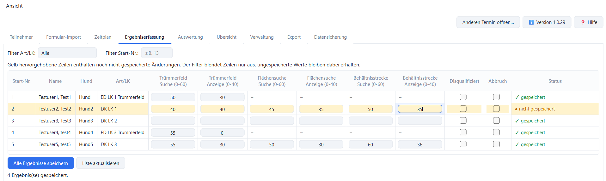
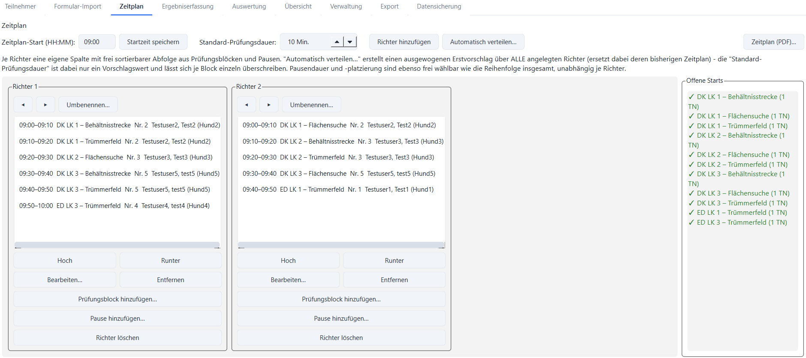
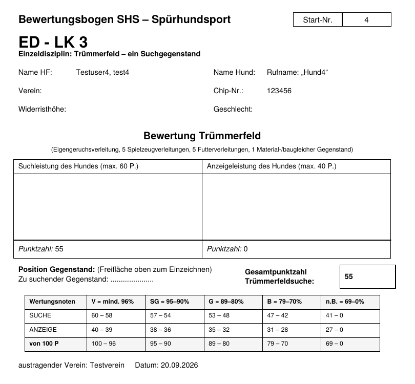

# SHS-Prüfungsprogramm

**Prüfungen im Spürhundsport (SHS) planen, auswerten und drucken – ohne Tabellenkalkulation.**

Das SHS-Prüfungsprogramm ist ein kostenloses Windows-Programm für die Prüfungsleitung eines
Vereins. Es deckt den ganzen Ablauf eines Prüfungstermins ab: von der Meldung der Teilnehmer
über Zeitplan und Bewertungsbögen bis zu Rangliste, Etiketten und Statistik.

Es ersetzt die bisherige LibreOffice-Datei „SHS Prüfungsprogramm“ samt Serienbrief-Vorlagen.
Wertnoten und Rangliste werden nach denselben Regeln berechnet wie dort.
**Du nutzt bisher die LibreOffice-Datei?** → [Umstiegsanleitung](docs/UMSTIEG.md)



## Download

➡️ **[Aktuelle Version herunterladen](https://github.com/mbruver-source/SHS/releases/latest)**

Dort unter „Assets“ die Datei `SHS-Pruefungsprogramm-Setup-X.Y.Z.exe` laden und starten.
Der Installer bringt alles mit, was das Programm braucht – Python oder andere Software
musst du nicht installieren. Administratorrechte sind nicht nötig.

> **Hinweis „Windows hat den Start dieser App verhindert“:** Der Installer ist noch nicht
> digital signiert, deshalb warnt Windows beim ersten Start. Auf **„Weitere Informationen“**
> und dann **„Trotzdem ausführen“** klicken. Das ist nur einmal nötig.

**Updates:** Im Programm über **Version → „Nach Updates suchen“**. Die neue Version einfach
über die alte installieren – deine Termine bleiben erhalten.

## Was das Programm kann

| Bereich | Was du damit machst |
|---|---|
| **Termine** | Jeder Prüfungstermin ist eine eigene Datei. Anlegen, öffnen, zwischen Terminen wechseln, abgeschlossene Termine vollständig löschen. |
| **Teilnehmer** | Hundeführer, Hund, Art (ED/DK), Leistungsklasse, Disziplin und bis zu drei Suchgegenstände erfassen. Startnummern werden vorgeschlagen, der Zahlungsstatus ist mit einem Klick gesetzt. Stammdaten lassen sich aus einem früheren Termin übernehmen. |
| **Formular-Import** | Ausgefüllte Meldeformulare (PDF, Word oder Foto) per KI-Assistent in eine CSV umwandeln und mit einem Klick importieren. Das Programm liefert den passenden Prompt gleich mit. |
| **Zeitplan** | Tagesablauf je Leistungsrichter mit Prüfungsblöcken und Pausen. Automatischer Verteilungsvorschlag oder Planung von Hand, Zeiten werden mitgerechnet. |
| **Ergebniserfassung** | Such- und Anzeigeleistung je Disziplin eintragen, auch Disqualifikation und Abbruch. Ungespeicherte Zeilen sind markiert. |
| **Auswertung** | Wertnote und Rangliste je Leistungsklasse, automatisch berechnet, inklusive „nicht bestanden“ (unter 70 Punkten in einer Disziplin). |
| **Übersicht** | Teilnehmerzahlen je Art/Leistungsklasse und die Zahl der benötigten Leistungsrichter. |
| **Druck / PDF** | Bewertungsbögen (alle 12 Varianten ED/DK × LK 1–3), Ergebnisliste (auch leer zum Ausfüllen), Etiketten, Statistik, Übersicht für die Prüfungsleitung, Richter-Bedarf, Zeitplan. |
| **Datensicherung** | Alle Termine in einer ZIP-Datei sichern und wiederherstellen, auf Wunsch mit Passwort (AES-256). |

<table>
<tr>
<td width="60%"></td>
<td width="40%"></td>
</tr>
<tr>
<td align="center"><em>Zeitplan je Leistungsrichter</em></td>
<td align="center"><em>Bewertungsbogen, direkt als PDF</em></td>
</tr>
</table>

Eine Bedienungshilfe zu jedem Reiter steht im Programm unter **„Hilfe“**.

## Optional: Ergebniserfassung im Browser für mehrere Richter

Für größere Prüfungen gibt es zusätzlich eine Web-Version: Mehrere Richter tragen am
Prüfungstag gleichzeitig Ergebnisse über den Browser ein (Tablet, Handy, Laptop), jeder mit
eigenem Benutzerkonto. Termin, Teilnehmer, Zeitplan und Druck bleiben in der Desktop-App,
die Ergebnisse werden anschließend zurückgeholt.

Die Web-Version läuft als Container und braucht etwas technische Einrichtung.
Für die meisten Vereine reicht die Desktop-App allein. Details: [README_CONTAINER.md](README_CONTAINER.md)

## Deine Daten

- Alles bleibt **auf deinem Rechner**, im Ordner `SHS-Pruefungsprogramm\Termine` in deinem
  Benutzerprofil. Das Programm schickt keine Teilnehmerdaten ins Internet. Nur „Nach
  Updates suchen“ fragt auf deinen Klick hin bei GitHub nach der neuesten Versionsnummer.
- Ein Termin lässt sich nach Abschluss vollständig löschen. Das ist gut für den Datenschutz,
  weil Teilnehmerdaten nicht länger als nötig aufbewahrt werden.
- Sichere deine Termine regelmäßig über den Reiter **„Datensicherung“**, zum Beispiel auf
  einen USB-Stick. Ein vergessenes Sicherungs-Passwort lässt sich nicht wiederherstellen.

## Fragen, Fehler, Wünsche

Fehler gefunden oder eine Idee? Bitte unter
[Issues](https://github.com/mbruver-source/SHS/issues) melden. Hilfreich sind die
Programmversion (Button „Version“), was du gemacht hast und was passiert ist, am besten mit
Screenshot. **Bitte keine echten Teilnehmerdaten** in Meldungen oder Screenshots.

## Für Entwickler

Python 3.11+, PySide6 (Desktop), Flask + PostgreSQL (Web), reportlab (PDF).

- Architektur und Module: [Architektur.md](Architektur.md)
- Installer bauen und Release erstellen: [README_INSTALLER.md](README_INSTALLER.md)
- Web-Version / Container: [README_CONTAINER.md](README_CONTAINER.md)
- Entscheidungs- und Änderungshistorie: [Fortschritt.md](Fortschritt.md)

```
pip install -r requirements.txt -r requirements-dev.txt
python app.py        # Desktop-App starten
pytest               # Tests
```

## Lizenz

MIT – siehe [LICENSE](LICENSE).

Die Windows-Installer sollen künftig kostenlos über die SignPath Foundation signiert werden;
siehe [CODE_SIGNING_POLICY.md](CODE_SIGNING_POLICY.md) für Rollen und Freigabeprozess.
