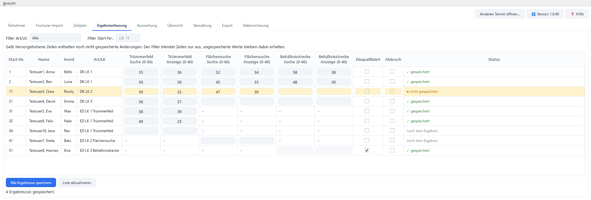
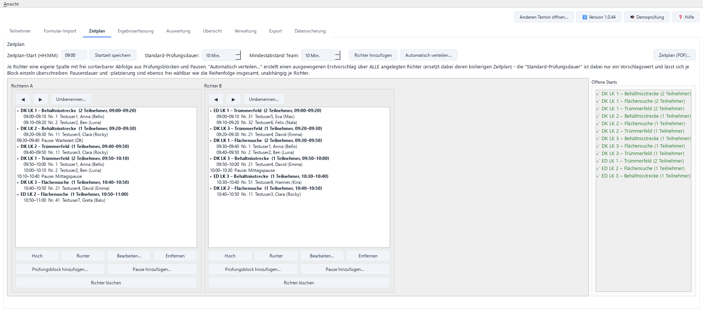
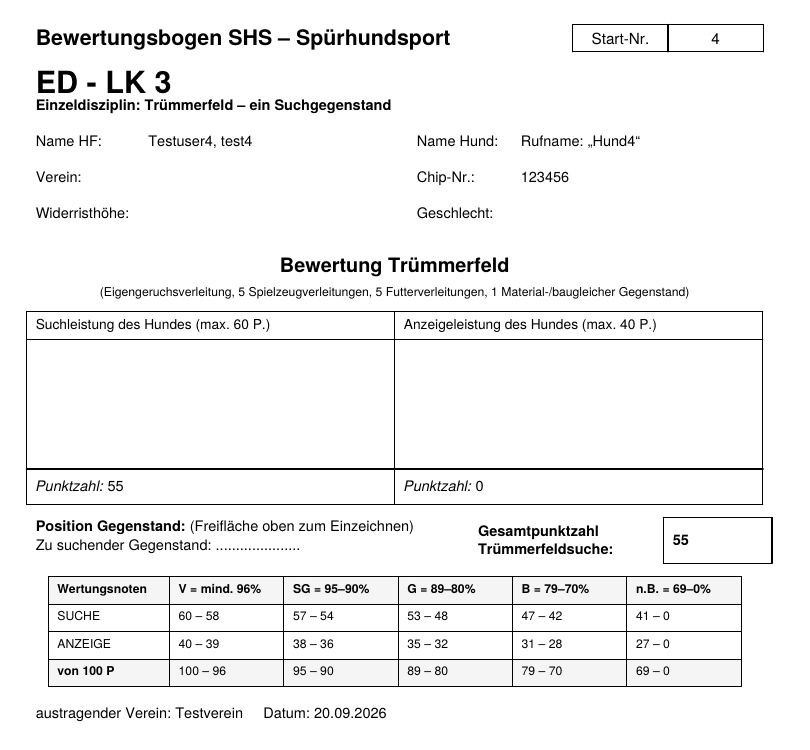

# SHS-Prüfungsprogramm

**Prüfungen im Spürhundsport (SHS) planen, auswerten und drucken – ohne Tabellenkalkulation.**

Das SHS-Prüfungsprogramm ist ein kostenloses Programm für Windows (macOS und Linux als
Vorschau) für die Prüfungsleitung eines Vereins. Es deckt den ganzen Ablauf eines
Prüfungstermins ab: von der Meldung der Teilnehmer über Zeitplan und Bewertungsbögen bis zu
Rangliste, Etiketten und Statistik.

Es ersetzt die bisherige LibreOffice-Datei „SHS Prüfungsprogramm“ samt Serienbrief-Vorlagen.
Wertnoten und Rangliste werden nach denselben Regeln berechnet wie dort.
**Du nutzt bisher die LibreOffice-Datei?** → [Umstiegsanleitung](docs/UMSTIEG.md)

🌐 **Website mit Handbuch:** [mbruver-source.github.io/SHS](https://mbruver-source.github.io/SHS/)



## Download

➡️ **[Aktuelle Version herunterladen](https://github.com/mbruver-source/SHS/releases/latest)**

**Windows:** Dort unter „Assets“ die Datei `SHS-Pruefungsprogramm-Setup-X.Y.Z.exe` laden und starten.
Der Installer bringt alles mit, was das Programm braucht – Python oder andere Software
musst du nicht installieren. Administratorrechte sind nicht nötig.

> **Hinweis „Windows hat den Start dieser App verhindert“:** Der Installer ist noch nicht
> digital signiert, deshalb warnt Windows beim ersten Start. Auf **„Weitere Informationen“**
> und dann **„Trotzdem ausführen“** klicken. Das ist nur einmal nötig.

**macOS und Linux (Vorschau):** Auf derselben Seite liegen außerdem
`SHS-Pruefungsprogramm-X.Y.Z-macOS-AppleSilicon.dmg` bzw. `…-macOS-Intel.dmg` sowie für Linux
`SHS-Pruefungsprogramm-X.Y.Z-x86_64.AppImage` und `shs-pruefungsprogramm_X.Y.Z_amd64.deb`.
Sie werden bei jedem Build automatisch geprüft, sind aber noch nicht auf echten Geräten
erprobt; Rückmeldungen sind willkommen. Die Mac-Version ist nicht bei Apple registriert,
den ersten Start musst du deshalb einmal erlauben – Schritt für Schritt im
[Handbuch, Kapitel 2](docs/HANDBUCH.md#2-installation-und-updates).

**Updates:** Im Programm oben rechts auf **„ℹ️ Version …“** klicken, dann
**„Nach Updates suchen“**. Die neue Version einfach
über die alte installieren – deine Termine bleiben erhalten.

**Ausprobieren:** Der Button **„🎓 Demoprüfung“** spielt einmal einen kompletten Prüfungstag
mit erfundenen Daten vor und erklärt jeden Schritt – deine Termine bleiben dabei unberührt
(siehe [„Demoprüfung“](docs/HANDBUCH.md#demoprüfung)). Mit der
[Beispiel-CSV mit 20 erfundenen Teilnehmern](docs/beispiel_teilnehmer.csv) lässt sich das
Programm danach gefahrlos selbst testen – Anleitung im Handbuch unter
[„Ausprobieren mit Beispieldaten“](docs/HANDBUCH.md#ausprobieren-mit-beispieldaten).

## Was das Programm kann

| Bereich | Was du damit machst |
|---|---|
| **Termine** | Jeder Prüfungstermin ist eine eigene Datei. Anlegen, öffnen, zwischen Terminen wechseln, abgeschlossene Termine vollständig löschen. |
| **Teilnehmer** | Hundeführer, Hund, Art (ED/DK), Leistungsklasse, Disziplin und bis zu drei Suchgegenstände erfassen. Startnummern kommen aus festen Bereichen je Prüfung und lassen sich gesammelt vergeben; Zahlungsstatus und „keine Teilnahme“ setzt ein Klick, auch für mehrere markierte Teilnehmer. Nicht erschienene Teilnehmer fallen damit aus Zeitplan, Wertung und Ausdrucken heraus. Stammdaten lassen sich aus einem früheren Termin übernehmen. |
| **Anmeldeformular** | Ausfüllbares Anmeldeformular (PDF) je Termin mit eingedruckten Termindaten und nur den angebotenen Prüfungen. Zurückgeschickte Formulare liest das Programm direkt ein – ohne Abtippen. |
| **Formular-Import** | Andere Meldeformulare (Word, Foto, Scan) per KI-Assistent in eine CSV umwandeln und importieren; der passende Prompt ist dabei. Außerdem Import einer Excel-Teilnehmerliste (CSV, mit leerer Vorlage) und des OMA-Meldungs-Exports. |
| **Zeitplan** | Tagesablauf je Leistungsrichter mit Prüfungsblöcken und Pausen. Automatischer Verteilungsvorschlag oder Planung von Hand, Zeiten werden mitgerechnet. Dreikampf-Teams stehen nie gleichzeitig bei zwei Richtern; Überschneidungen werden rot markiert. Eine Pause lässt sich bei allen Richtern auf einmal einfügen. |
| **Ergebniserfassung** | Such- und Anzeigeleistung je Disziplin eintragen, auch Disqualifikation und Abbruch. Ungespeicherte Zeilen sind markiert. |
| **Auswertung** | Wertnote und Rangliste je Leistungsklasse, automatisch berechnet, inklusive „nicht bestanden“ (unter 70 Punkten in einer Disziplin). |
| **Übersicht** | Teilnehmerzahlen je Art/Leistungsklasse und die Zahl der benötigten Leistungsrichter. |
| **Druck / PDF** | Bewertungsbögen (alle 12 Varianten ED/DK × LK 1–3), Ergebnisliste (auch leer zum Ausfüllen), Etiketten, Statistik, Übersicht für die Prüfungsleitung, Richter-Bedarf, Zeitplan. Teilnehmerliste als CSV für Excel. |
| **Datensicherung** | Alle Termine in einer Sicherungsdatei (ZIP) sichern und wiederherstellen, auf Wunsch mit Passwort verschlüsselt (AES-256). |
| **Demoprüfung** | Führt einen ganzen Prüfungstag mit erfundenen Daten vor – vom Termin bis zur Ergebnisliste. Das Programm klickt selbst, ein Fenster erklärt jeden Schritt. Der Demo-Termin wird danach gelöscht. |

<table>
<tr>
<td width="60%"></td>
<td width="40%"></td>
</tr>
<tr>
<td align="center"><em>Zeitplan je Leistungsrichter</em></td>
<td align="center"><em>Bewertungsbogen, direkt als PDF</em></td>
</tr>
</table>

📖 **[Benutzerhandbuch](docs/HANDBUCH.md)** – Schritt für Schritt durch einen Prüfungstermin,
mit Screenshots (auch als [PDF zum Ausdrucken](docs/HANDBUCH.pdf)). Eine Kurzhilfe zu jedem
Reiter steht im Programm unter **„Hilfe“**.

## Optional: Ergebniserfassung im Browser für mehrere Richter

Für größere Prüfungen gibt es zusätzlich eine Web-Version: Mehrere Richter tragen am
Prüfungstag gleichzeitig Ergebnisse über den Browser ein (Tablet, Handy, Laptop), jeder mit
eigenem Benutzerkonto. Termin, Teilnehmer, Zeitplan und Druck bleiben in der Desktop-App,
die Ergebnisse werden anschließend zurückgeholt.

Die Web-Version läuft als Container und braucht etwas technische Einrichtung.
Für die meisten Vereine reicht die Desktop-App allein. Details: [README_CONTAINER.md](README_CONTAINER.md)

## Deine Daten

- Alles bleibt **auf deinem Rechner**, im Ordner `SHS-Pruefungsprogramm\Termine` in deinem
  Benutzerprofil. Das Programm schickt keine Teilnehmerdaten ins Internet. Nur „Nach
  Updates suchen“ fragt auf deinen Klick hin bei GitHub nach der neuesten Versionsnummer.
- Ein Termin lässt sich nach Abschluss vollständig löschen. Das ist gut für den Datenschutz,
  weil Teilnehmerdaten nicht länger als nötig aufbewahrt werden.
- Sichere deine Termine regelmäßig über den Reiter **„Datensicherung“**, zum Beispiel auf
  einen USB-Stick. Ein vergessenes Sicherungs-Passwort lässt sich nicht wiederherstellen.

## Fragen, Fehler, Wünsche

Fehler gefunden oder eine Idee? Bitte unter
[Issues](https://github.com/mbruver-source/SHS/issues/new/choose) mit der Vorlage
**„Fehler melden“** bzw. **„Idee / Wunsch“** melden. Die Formulare fragen die wichtigen Angaben
(Programmversion, Schritte, Screenshot) direkt ab. **Bitte keine echten Teilnehmerdaten** in
Meldungen oder Screenshots.

Sicherheitslücken bitte **nicht** als Issue melden, sondern wie in der
[Sicherheitsrichtlinie](.github/SECURITY.md) beschrieben.

## Für Entwickler

Python 3.11+, PySide6 (Desktop), Flask + PostgreSQL (Web), reportlab (PDF).

- Architektur und Module: [Architektur.md](Architektur.md)
- Installer bauen und Release erstellen: [README_INSTALLER.md](README_INSTALLER.md)
- Web-Version / Container: [README_CONTAINER.md](README_CONTAINER.md)
- Entscheidungs- und Änderungshistorie: [Fortschritt.md](Fortschritt.md)
- Mitwirken und Verhaltensregeln: [CONTRIBUTING.md](.github/CONTRIBUTING.md),
  [CODE_OF_CONDUCT.md](.github/CODE_OF_CONDUCT.md)

```
pip install -r requirements.txt -r requirements-dev.txt
python app.py        # Desktop-App starten
pytest               # Tests
```

## Lizenz

MIT – siehe [LICENSE](LICENSE).

Die Windows-Installer sollen künftig kostenlos über die SignPath Foundation signiert werden;
siehe [CODE_SIGNING_POLICY.md](CODE_SIGNING_POLICY.md) für Rollen und Freigabeprozess.
