# Benutzerhandbuch SHS-Prüfungsprogramm

Dieses Handbuch führt Schritt für Schritt durch einen Prüfungstermin – vom Anlegen über den
Prüfungstag bis zur Datensicherung. Es richtet sich an die **Prüfungsleitung** (Desktop-Programm)
und in [Kapitel 11](#11-für-richter-ergebnisse-im-browser-eintragen) an **Richter**, die Ergebnisse
über die optionale Web-Version eintragen.

Stand: Version 1.0.33. Alle Screenshots zeigen erfundene Testdaten.

- Umstieg von der LibreOffice-Datei: [UMSTIEG.md](UMSTIEG.md)
- Einrichtung der Web-Version (Server/Container): [README_CONTAINER.md](../README_CONTAINER.md)
- Kurzhilfe im Programm: Button **„❓ Hilfe“** oben rechts

## Inhalt

1. [Ablauf eines Prüfungstermins](#1-ablauf-eines-prüfungstermins)
2. [Installation und Updates](#2-installation-und-updates)
3. [Termine](#3-termine)
4. [Teilnehmer](#4-teilnehmer)
5. [Formular-Import](#5-formular-import)
6. [Zeitplan](#6-zeitplan)
7. [Ergebniserfassung](#7-ergebniserfassung)
8. [Auswertung und Übersicht](#8-auswertung-und-übersicht)
9. [Verwaltung und Export](#9-verwaltung-und-export)
10. [Datensicherung](#10-datensicherung)
11. [Für Richter: Ergebnisse im Browser eintragen](#11-für-richter-ergebnisse-im-browser-eintragen)
12. [Für die Prüfungsleitung: Termin im Web veröffentlichen](#12-für-die-prüfungsleitung-termin-im-web-veröffentlichen)
13. [Häufige Fragen und Probleme](#13-häufige-fragen-und-probleme)

---

## 1. Ablauf eines Prüfungstermins

| Wann | Was | Wo |
|---|---|---|
| Wochen vorher | Termin anlegen, Veranstaltungsdaten eintragen | Startbildschirm, Reiter „Verwaltung“ |
| Mit den Meldungen | Teilnehmer erfassen, Zahlungen abhaken | Reiter „Teilnehmer“, „Formular-Import“ |
| 8 Tage vorher | Zeitplan erstellen, Kontakt zu den Richtern aufnehmen und ihnen den Zeitplan übermitteln (PDF), bei späteren Änderungen erneut senden | Reiter „Zeitplan“ |
| Kurz vorher | Startnummern und Gegenstände prüfen, Bewertungsbögen und Listen drucken | Reiter „Teilnehmer“, „Export“ |
| Am Prüfungstag | Ergebnisse eintragen, regelmäßig speichern | Reiter „Ergebniserfassung“ (oder Web-Version) |
| Danach | Rangliste, Ergebnisliste, Etiketten, Statistik | Reiter „Auswertung“, „Export“ |
| Zum Schluss | Datensicherung erstellen; abgeschlossene Termine später löschen | Reiter „Datensicherung“, Startbildschirm |

Das Programm arbeitet vollständig **offline**. Internet brauchst du nur für die Update-Suche,
für den optionalen Formular-Import per KI und für die optionale Web-Version.

## 2. Installation und Updates

- **Installieren:** Die Datei `SHS-Pruefungsprogramm-Setup-X.Y.Z.exe` von der
  [Release-Seite](https://github.com/mbruver-source/SHS/releases/latest) laden und starten.
  Administratorrechte sind nicht nötig. Erscheint „Windows hat den Start dieser App
  verhindert“, auf **„Weitere Informationen“** → **„Trotzdem ausführen“** klicken.
- **Version prüfen und aktualisieren:** Oben rechts auf **„ℹ️ Version …“** klicken, dann
  **„Nach Updates suchen“**. Gibt es eine neuere Version, erscheint
  **„Neue Version herunterladen (GitHub öffnen)“**. Die neue Version einfach über die alte
  installieren – deine Termine bleiben erhalten. Eine automatische Suche im Hintergrund gibt es
  bewusst nicht.
- **Aussehen:** Im Menü **„Ansicht“** gibt es zwei Einstellungen, die sich frei kombinieren
  lassen und gespeichert werden:
  - **„Hintergrund“:** Hell (Standard), Warm / Sand, Dunkel oder Hoher Kontrast. Hoher
    Kontrast eignet sich z. B. für einen Laptop draußen am Prüfungstag.
  - **„Akzentfarbe“:** Blau, Grün oder Violett, die Farbe der Haupt-Schaltflächen und der
    Markierungen.

  Beim Design Dunkel bleibt das Windows-Fenster zum Öffnen und Speichern von Dateien hell.
  Dieses Fenster stammt von Windows selbst.

## 3. Termine

Jeder Prüfungstermin ist eine eigene Datei. Standardmäßig liegen alle Termine im Ordner
`SHS-Pruefungsprogramm\Termine` in deinem Benutzerprofil (z. B.
`C:\Users\Name\SHS-Pruefungsprogramm\Termine`).

### Startbildschirm

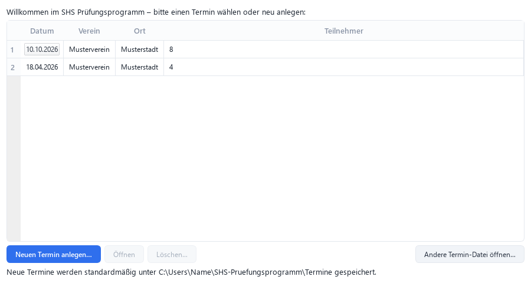

Beim Programmstart siehst du alle Termine mit Datum, Verein, Ort und Teilnehmerzahl, der neueste
steht oben.

| Button | Wirkung |
|---|---|
| **„Neuen Termin anlegen…“** | Öffnet die Eingabe der Veranstaltungsdaten (siehe unten). Verein, Vereins-Nr. und Ort werden vom neuesten Termin übernommen. |
| **„Öffnen“** (oder Doppelklick) | Öffnet den markierten Termin. |
| **„Löschen…“** | Löscht den markierten Termin nach Rückfrage **unwiderruflich**, mit allen Teilnehmer- und Ergebnisdaten. Der gerade geöffnete Termin lässt sich nicht löschen. |
| **„Andere Termin-Datei öffnen…“** | Öffnet eine Termin-Datei (`*.sqlite`) von einem anderen Ort, z. B. einem USB-Stick. |

Im Hauptfenster wechselst du jederzeit über **„Anderen Termin öffnen…“** oben rechts.

### Neuen Termin anlegen

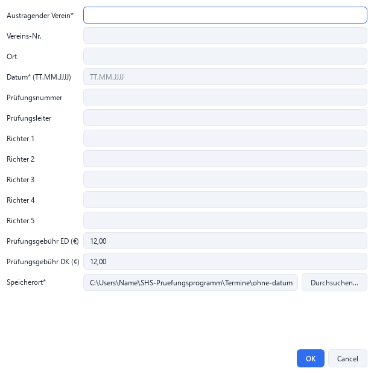

Pflicht sind **Austragender Verein\*** und **Datum\*** (TT.MM.JJJJ). Alle weiteren Angaben –
Vereins-Nr., Ort, Prüfungsnummer, Prüfungsleiter, Richter 1–5, Prüfungsgebühr ED/DK – kannst
du auch später im Reiter „Verwaltung“ nachtragen. Sie erscheinen im Kopf der Statistik und in
der Übersicht für die Prüfungsleitung.

Der **Speicherort\*** wird automatisch als `JJJJ-MM-TT_Verein.sqlite` vorgeschlagen. Behalte
den Vorschlag möglichst bei: Nur Termine im Standardordner erscheinen im Startbildschirm und
werden von der Datensicherung erfasst.

## 4. Teilnehmer

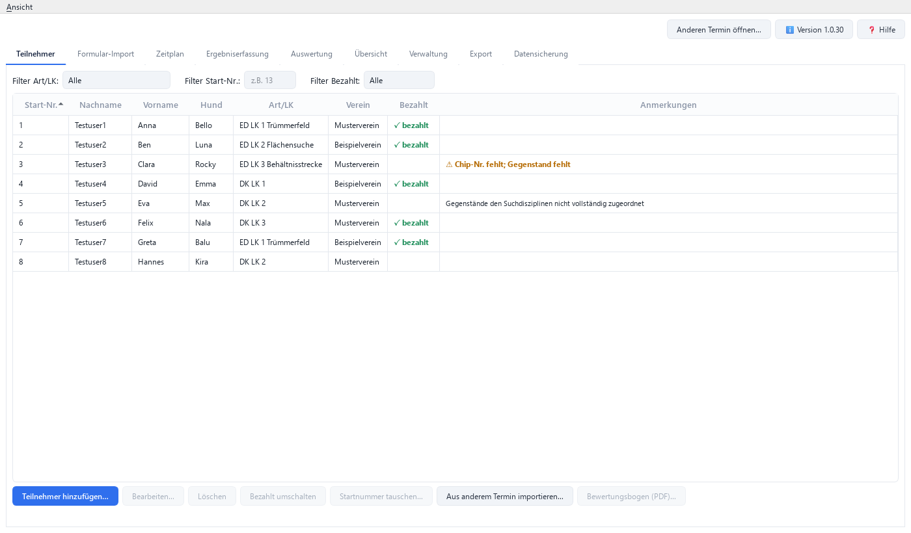

Die Liste zeigt Startnummer, Name, Hund, Art/LK, Verein, Bezahlt-Status und **Anmerkungen**.
Ein Klick auf eine Spaltenüberschrift sortiert. Die Filter **„Filter Art/LK“**,
**„Filter Start-Nr.“** und **„Filter Bezahlt“** blenden Zeilen nur aus.

| Button | Wirkung |
|---|---|
| **„Teilnehmer hinzufügen…“** | Öffnet die Erfassungsmaske. Die kleinste freie Startnummer wird vorgeschlagen. |
| **„Bearbeiten…“** | Öffnet die Maske für den markierten Teilnehmer. |
| **„Löschen“** | Löscht den markierten Teilnehmer nach Rückfrage, inklusive Ergebnis. |
| **„Bezahlt umschalten“** | Setzt oder entfernt „✓ bezahlt“ sofort, ohne die Maske zu öffnen. |
| **„Startnummer tauschen…“** | Tauscht die Startnummern zweier Teilnehmer in einem Schritt. |
| **„Aus anderem Termin importieren…“** | Übernimmt Teilnehmer aus einem früheren Termin (siehe unten). |
| **„Bewertungsbogen (PDF)…“** | Erzeugt sofort den Bewertungsbogen nur für den markierten Teilnehmer. |

### Die Erfassungsmaske

Pflichtfelder sind mit \* markiert: **Nachname\***, **Vorname\***, **Rufname Hund\***,
**Art\*** (ED = Einzeldisziplin, DK = Dreikampf) und **Leistungsklasse\*** (1–3). Bei ED wählst
du zusätzlich die **Disziplin** (Trümmerfeld, Flächensuche oder Behältnisstrecke). Alle anderen
Felder sind optional. Datumsfelder nehmen TT.MM.JJJJ an.

- **Startnummer:** Steht sie noch nicht fest, setze das Häkchen
  **„Startnummer steht noch nicht fest“**. Eine bereits vergebene Nummer lehnt das Programm ab und
  nennt, wer sie hat.
- **Halter:** Weicht der Hundeeigentümer vom Hundeführer ab, das Häkchen
  **„Halter weicht vom Hundeführer ab“** setzen – dann erscheinen die Halter-Felder.
- **Prüfungsgebühr bezahlt:** Häkchen in der Maske oder später „Bezahlt umschalten“.

### Suchgegenstände

Hinter jedem Gegenstand legst du bei **„gesucht in:“** fest, in welcher Disziplin er gesucht wird.
Das bestimmt, auf welchem Bewertungsbogen er erscheint.

**Einzeldisziplin (ED):** Es gibt nur eine Suchdisziplin und deshalb – in jeder Leistungsklasse –
genau **einen** Gegenstand. Nur **Gegenstand 1** ist eingabebereit, „gesucht in“ folgt
automatisch der gewählten Disziplin. Gegenstand 2 und 3 sind ausgegraut.

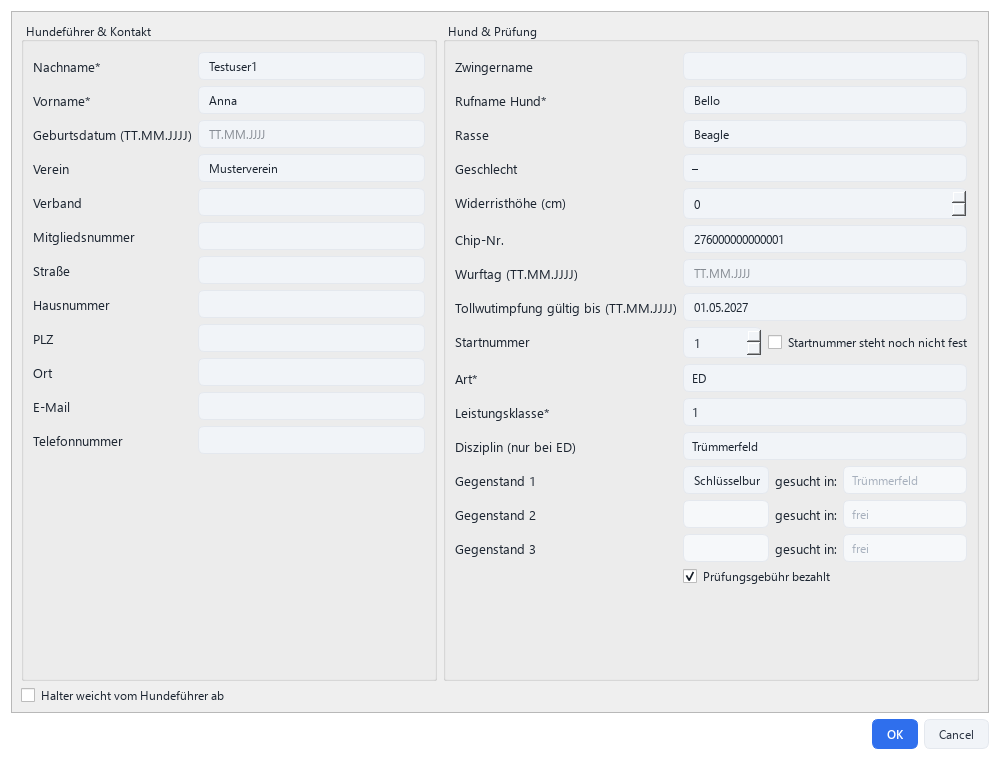

**Dreikampf (DK):** Alle drei Felder sind frei wählbar. Mindestens nötig sind unterschiedliche
Gegenstände je Leistungsklasse:

| Leistungsklasse | Mindestens |
|---|---|
| DK LK 1 | 1 Gegenstand |
| DK LK 2 | 2 verschiedene Gegenstände |
| DK LK 3 | 3 verschiedene Gegenstände |

- Du kannst alle Gegenstände auf **„frei“** lassen – dann genügt die Mindestanzahl.
- Ordnest du Disziplinen zu, sollten alle drei Disziplinen belegt sein. Derselbe Gegenstand darf
  dafür in mehreren Feldern stehen (z. B. LK 1: dreimal „Schlüsselbund“, je mit einer anderen
  Disziplin).
- Jede Disziplin darf nur **einem** Feld zugeordnet sein, sonst erscheint
  „Gegenstand-Zuordnung doppelt vergeben“.

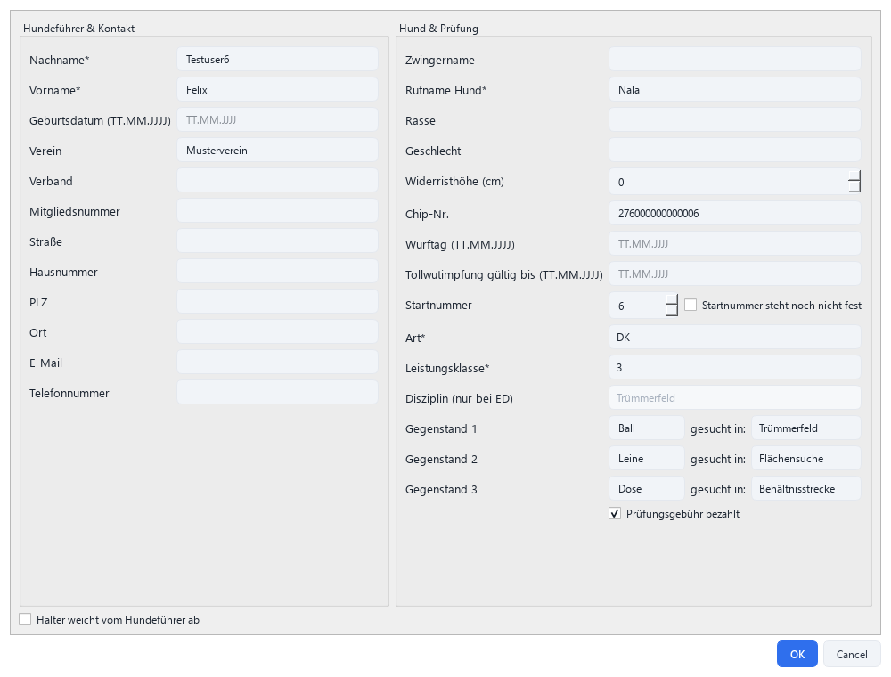

### Spalte „Anmerkungen“

Die Spalte zeigt, ob für die Prüfung noch etwas fehlt. **Warnungen** (orange, fett, mit ⚠)
solltest du vor dem Prüfungstag beheben; **Hinweise** (klein) sind nur Erinnerungen.

| Meldung | Art | Bedeutung |
|---|---|---|
| ⚠ Chip-Nr. fehlt | Warnung | Keine Chipnummer eingetragen. |
| ⚠ Gegenstand fehlt | Warnung | ED ohne Gegenstand. |
| ⚠ Gegenstände unvollständig (Dreikampf) | Warnung | DK mit weniger verschiedenen Gegenständen als die Mindestanzahl. |
| Gegenstände den Suchdisziplinen nicht vollständig zugeordnet | Hinweis | DK: Die Zuordnung ist begonnen, deckt aber nicht alle drei Disziplinen ab. |
| Gegenstand der Suchdisziplin nicht zugeordnet | Hinweis | ED (ältere Daten): Gegenstand ohne Zuordnung. Einmal öffnen und speichern behebt das. |
| Bei ED ist nur ein Gegenstand vorgesehen | Hinweis | ED (ältere Daten) mit mehreren Gegenständen. |

### Teilnehmer aus einem früheren Termin übernehmen

**„Aus anderem Termin importieren…“** zeigt die übrigen Termine zur Auswahl und darunter deren
Teilnehmer mit Häkchen (**„Alle auswählen“** / **„Keine auswählen“**). Übernommen werden nur die
**Stammdaten** einschließlich Art, Leistungsklasse und Disziplin – nicht Startnummer,
Gegenstände, Bezahlt-Status und Ergebnis. Es gibt keine Dublettenprüfung: Wer schon im Termin
steht, wird bei erneutem Import ein zweites Mal angelegt.

## 5. Formular-Import

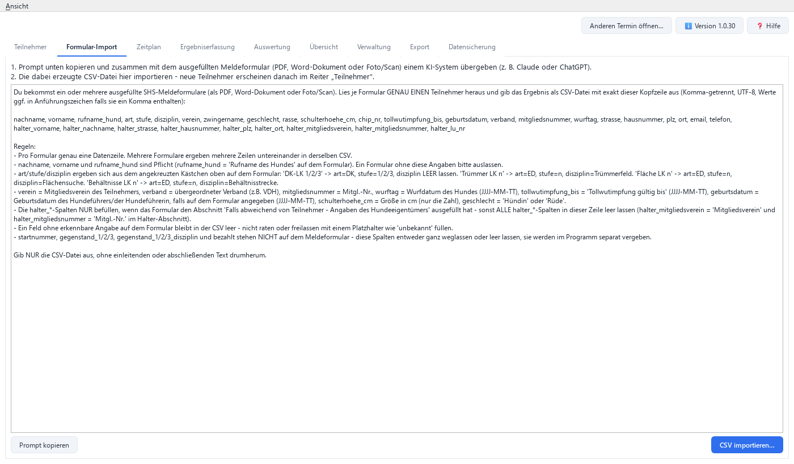

Ausgefüllte Meldeformulare (PDF, Word oder Foto/Scan) lassen sich mit einem KI-Assistenten
(z. B. Claude oder ChatGPT) in eine CSV-Datei umwandeln:

1. **„Prompt kopieren“** klicken.
2. Im KI-Assistenten den Prompt einfügen und die Meldeformulare anhängen.
3. Die erzeugte CSV-Datei speichern und hier mit **„CSV importieren…“** einlesen.

Jede Zeile wird ein neuer Teilnehmer – ohne Startnummer, Gegenstände und Bezahlt-Status (diese
trägst du danach im Reiter „Teilnehmer“ nach). Fehlerhafte Zeilen werden übersprungen und nach
dem Import mit Zeilennummer und Grund aufgelistet, z. B. fehlende Pflichtangaben, Art nicht
ED/DK, Leistungsklasse nicht 1–3, ED ohne gültige Disziplin oder ein ungültiges Datum. Die Datei
muss UTF-8-kodiert sein.

> **Datenschutz:** Beim Formular-Import gehen die Meldeformulare an den gewählten KI-Anbieter.
> Kläre vorher, ob das für deinen Verein in Ordnung ist. Das Programm selbst sendet nichts.

### Meldungen aus der OMA übernehmen

Den Meldungs-Export der OMA (Online-Meldeannahme, Datei „OMA-ExportGeneric_Spürhundesport…“)
liest du ohne KI direkt mit **„OMA-Export importieren…“** ein. Jede Zeile wird ein Teilnehmer.

- **Übernommen:** Vorname, Nachname, Geburtsdatum, E-Mail, Verein, Verband, Mitgliedsnummer
  des Hundeführers. Dazu Rufname, Zwingername, Rasse, Geschlecht, Wurftag, Chipnummer und
  LU-Nr. des Hundes sowie Leistungsklasse und Disziplin. Aus „LK2 Behältnissuche“ wird z. B.
  ED, LK2, Behältnisstrecke, aus „LK1 Dreikampf“ wird DK, LK1.
- Ist beim Hundeführer kein Verband angegeben, wird der Verband des Leistungshefts genommen.
- **Nicht übernommen:** Anrede, Land, Zuchtbuchnummer und die Meldungsangaben (Status,
  Mannschaft, Bezahlt, Startgeld, Kommentar). Startnummer, Gegenstände und Bezahlt-Status
  trägst du wie gewohnt im Reiter „Teilnehmer“ nach.
- **Erneuter Import:** Eine Meldung mit gleichem Namen, Hund, Art, Leistungsklasse und Disziplin
  wird nicht noch einmal angelegt. Du kannst also einen späteren Export mit Nachmeldungen
  einfach erneut einlesen.
- Da die LU-Nr. im Halter-Block gespeichert wird, ist im Teilnehmer-Dialog bei importierten
  Meldungen „Halter weicht ab“ angehakt. Das ist kein Fehler.

## 6. Zeitplan

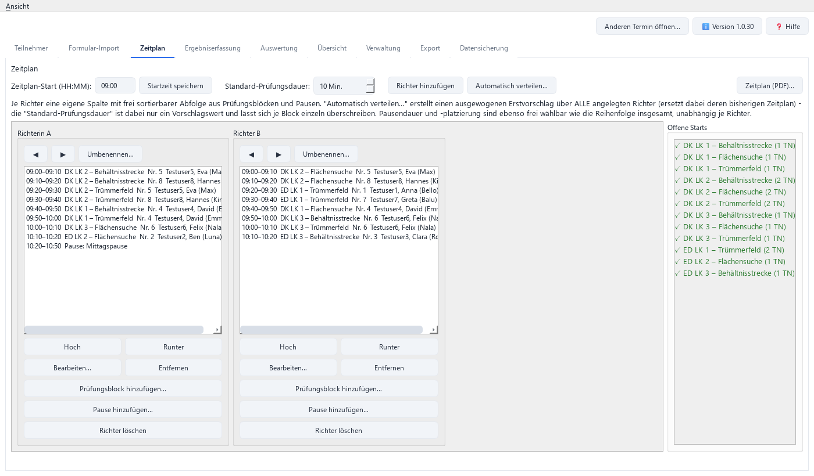

Der Zeitplan hat eine Spalte je Richter.

1. **„Zeitplan-Start (HH:MM)“** eintragen und **„Startzeit speichern“**.
2. Mit **„Richter hinzufügen“** je Richter eine Spalte anlegen, mit **„Umbenennen…“** benennen,
   mit ◀ ▶ verschieben.
3. Entweder **„Automatisch verteilen…“** für einen ausgewogenen Vorschlag – das **ersetzt** den
   bisherigen Plan aller Richter, nach Rückfrage – oder von Hand je Richter
   **„Prüfungsblock hinzufügen…“** (Art, Leistungsklasse, Disziplin, Dauer je Teilnehmer) und
   **„Pause hinzufügen…“**.
4. Reihenfolge mit **„Hoch“** / **„Runter“** anpassen, Dauer mit **„Bearbeiten…“** ändern.
   Start- und Endzeiten rechnet das Programm selbst.
5. **„Zeitplan (PDF)…“** erzeugt eine Seite je Richter.

Die Seitenleiste **„Offene Starts“** zeigt je Art/Leistungsklasse/Disziplin, ob schon ein Block
existiert (grün ✓) oder noch fehlt (rot ✗ „noch offen“).

> **Wichtig zu „Entfernen“:** Ein Prüfungsblock merkt sich nur Art, Leistungsklasse, Disziplin
> und Dauer. Wer darin geprüft wird, ergibt sich jedes Mal neu aus der Teilnehmerliste.
> „Entfernen“ löscht deshalb immer den **ganzen Block**. Fällt ein Teilnehmer aus, einfach im
> Reiter „Teilnehmer“ löschen – der Zeitplan passt sich von selbst an.

## 7. Ergebniserfassung

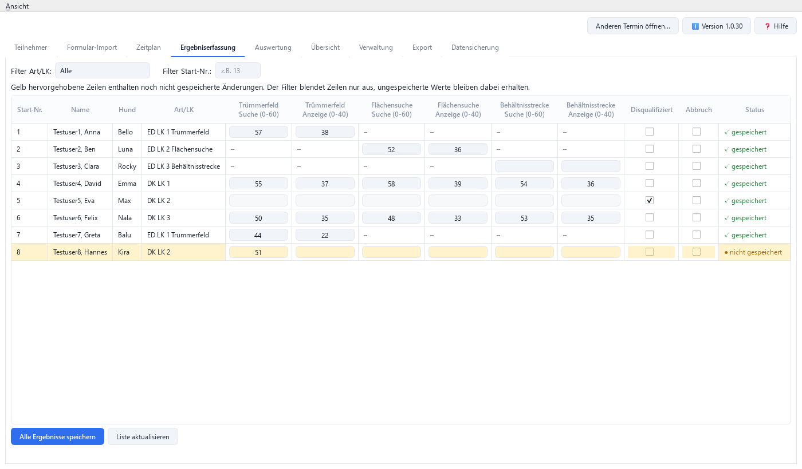

Eine Zeile je Teilnehmer, bei DK alle drei Disziplinen nebeneinander. Je Disziplin trägst du
**Suche (0-60)** und **Anzeige (0-40)** ein. Bei ED sind die anderen Disziplinen mit „–“
gesperrt.

- **Gelbe Zeilen** mit „● nicht gespeichert“ enthalten Änderungen, die noch nicht gesichert sind.
- **„Alle Ergebnisse speichern“** sichert alle Änderungen auf einmal. Speichere am Prüfungstag
  regelmäßig.
- Suche **und** Anzeige gehören zusammen. Ist nur eines der beiden Felder ausgefüllt, wird die
  Zeile nicht gespeichert: „Bitte Suche UND Anzeige eintragen oder beide Felder leer lassen.“
- **Ergebnis entfernen:** beide Felder leeren und speichern.
- **„Disqualifiziert“** bzw. **„Abbruch“** ankreuzen leert und sperrt die Punktefelder.
- Die Filter blenden nur aus, ungespeicherte Eingaben bleiben erhalten. **„Liste aktualisieren“**
  fragt vorher nach, wenn noch etwas ungespeichert ist.

Beim Wechsel des Reiters oder Termins fragt das Programm bei ungespeicherten Ergebnissen
„Jetzt speichern?“. Beim **Schließen** des Programms werden ungespeicherte Ergebnisse
automatisch gespeichert.

## 8. Auswertung und Übersicht

### Auswertung

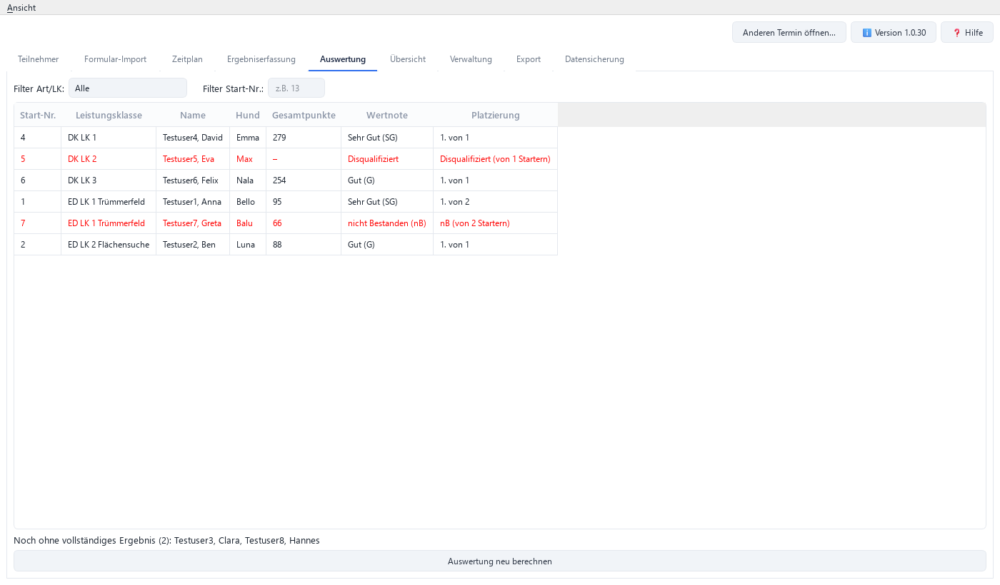

Die Rangliste je Leistungsklasse mit Gesamtpunkten, Wertnote und Platzierung („1. von 2“) wird
automatisch berechnet. **„Auswertung neu berechnen“** aktualisiert die Anzeige. Unten steht,
wer noch kein vollständiges Ergebnis hat.

**„Rangliste drucken (PDF)…“** speichert die Rangliste direkt als PDF. Ist im Filter eine
Art/Leistungsklasse gewählt, enthält das PDF nur diese, sonst alle. Der Filter nach
Startnummer wird dabei nicht berücksichtigt.

| Wertnote | ED (max. 100) | DK (max. 300) |
|---|---|---|
| Vorzüglich (V) | ab 96 | ab 286 |
| Sehr Gut (SG) | ab 90 | ab 270 |
| Gut (G) | ab 80 | ab 240 |
| Befriedigend (B) | ab 70 | ab 210 |

- **Bestanden** ist nur, wer in **jeder** Disziplin mindestens 70 Punkte hat – sonst
  „nicht Bestanden (nB)“, unabhängig von der Gesamtpunktzahl. In der Platzierung steht dann
  „nB (von N Startern)“.
- Punktgleiche erhalten denselben Platz. Nicht bestanden, Disqualifiziert und Abbruch erhalten
  keinen Platz, zählen aber bei den Startern mit und erscheinen rot.

### Übersicht

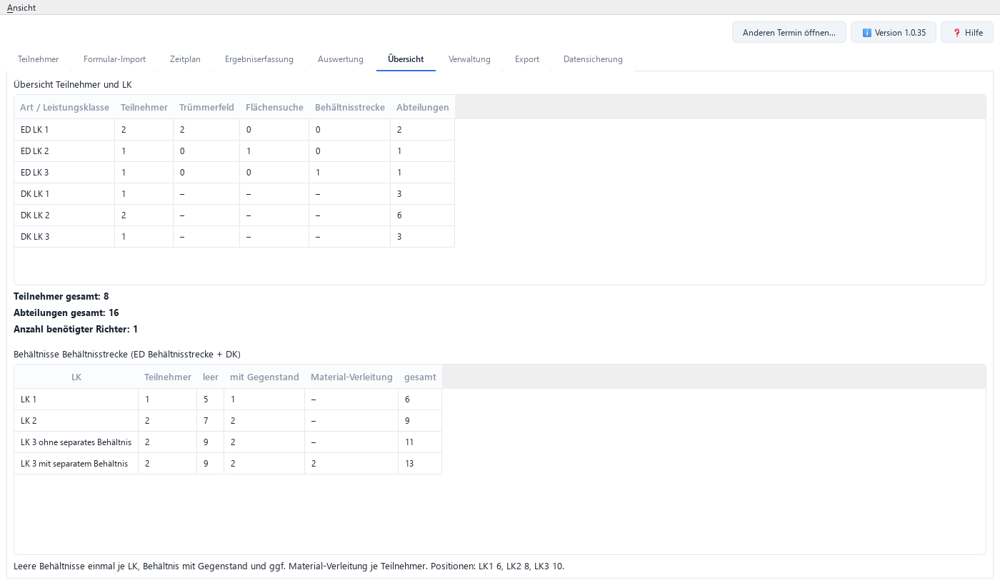

Teilnehmerzahlen je Art/Leistungsklasse und Disziplin, die Zahl der Abteilungen und die
**Anzahl benötigter Richter** (1 ED = 1 Einheit, 1 DK = 3 Einheiten, höchstens 36 Einheiten je
Richter).

## 9. Verwaltung und Export

### Verwaltung

**„Veranstaltungsdaten bearbeiten…“** ändert Verein, Ort, Datum, Vereins-Nr., Prüfungsnummer,
Prüfungsleiter, Richter 1–5 und die Prüfungsgebühren nachträglich.

### Export

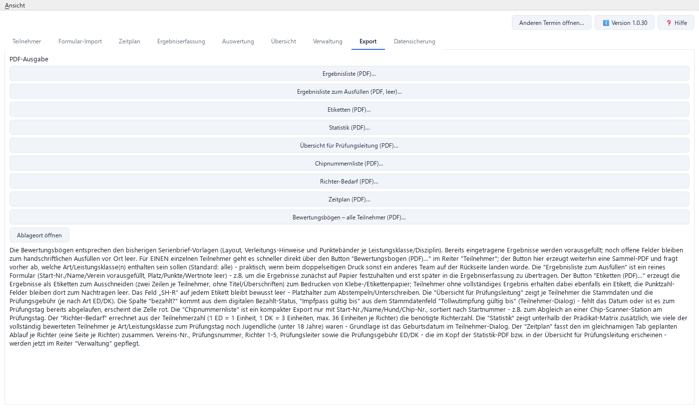

Jeder Button fragt nach dem Speicherort (Vorschlag: Ordner der Termin-Datei bzw. zuletzt
gewählter Ordner) und erzeugt ein PDF. **„Ablageort öffnen“** zeigt diesen Ordner im Explorer.

| Button | Inhalt |
|---|---|
| **Ergebnisliste (PDF)…** | Rangliste mit Wertnoten je Leistungsklasse |
| **Ergebnisliste zum Ausfüllen (PDF, leer)…** | Formular mit Start-Nr./Name/Verein, Platz/Punkte/Wertnote leer – z. B. für Papier am Prüfungstag |
| **Etiketten (PDF)…** | Ergebnis-Etiketten zum Aufkleben (2 Zeilen je Teilnehmer); unvollständige Ergebnisse mit leeren Punktfeldern, Feld „SH-R“ zum Abstempeln |
| **Statistik (PDF)…** | Prädikat-Übersicht je Art/LK inkl. Jugendliche (unter 18); im Kopf Vereins-Nr., Prüfungsnummer, Richter, Prüfungsleiter |
| **Übersicht für Prüfungsleitung (PDF)…** | Stammdaten, Gebühr, bezahlt?, Impfpass gültig bis (rot bei fehlendem oder abgelaufenem Datum) |
| **Chipnummernliste (PDF)…** | Start-Nr., Name, Hund, Chip-Nr. – z. B. für den Chip-Abgleich |
| **Richter-Bedarf (PDF)…** | Berechnete Zahl benötigter Richter |
| **Zeitplan (PDF)…** | Eine Seite je Richter |
| **Bewertungsbögen – alle Teilnehmer (PDF)…** | Sammel-PDF aller Bewertungsbögen; vorher Auswahl der Leistungsklassen/Disziplinen. Vorhandene Ergebnisse sind vorausgefüllt. |

Den Bewertungsbogen eines **einzelnen** Teilnehmers erzeugst du schneller im Reiter
„Teilnehmer“ mit **„Bewertungsbogen (PDF)…“**.

Ein ED-Bogen hat immer **eine** Seite, ein DK-Bogen immer **zwei** Seiten: Seite 1 mit
Trümmerfeld, Seite 2 mit Fläche, Behältnisstrecke und Gesamtergebnis. DK-Bögen kannst du
deshalb beidseitig drucken. ED-Bögen druckst du am besten einseitig, sonst steht auf der
Rückseite das nächste Team.
Zum Einzeichnen des Verstecks gibt es je Disziplin eine eigene Skizze: ein Quadrat beim
Trümmerfeld, ein Feld mit Mittelstreifen bei der Flächensuche und nummerierte Behälter bei der
Behältnisstrecke.

## 10. Datensicherung

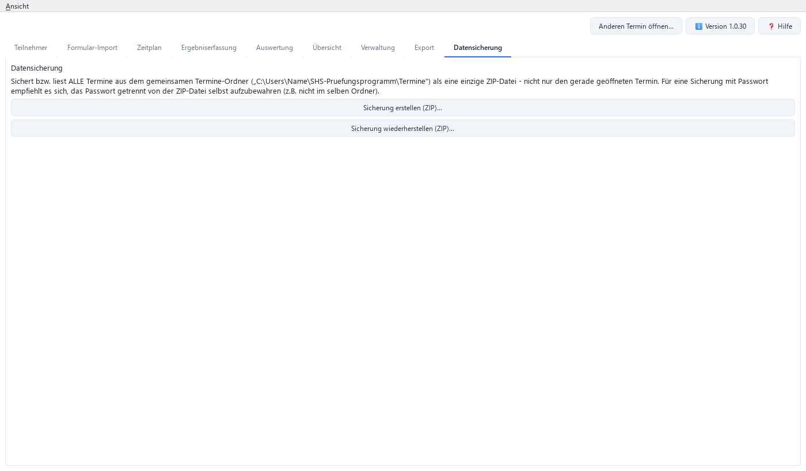

Gesichert werden immer **alle** Termine aus dem Termine-Ordner in einer ZIP-Datei.

- **„Sicherung erstellen (ZIP)…“:** Auf Wunsch **„Mit Passwort schützen“** (AES-256), danach
  den Speicherort wählen, z. B. einen USB-Stick. **Ein vergessenes Passwort lässt sich nicht
  wiederherstellen.** Bewahre es getrennt von der Sicherung auf.
- **„Sicherung wiederherstellen (ZIP)…“:** Fragt bei Bedarf nach dem Passwort. Für jeden Termin,
  den es schon gibt, wählst du **„Überschreiben“**, **„Als Kopie importieren“** oder
  **„Überspringen“**. Den gerade geöffneten Termin kann man nicht überschreiben.
  Wiederhergestellte Termine erscheinen beim nächsten „Anderen Termin öffnen…“.

**Umzug auf einen anderen Rechner:** Auf dem alten Rechner eine Sicherung erstellen, auf dem neuen
Rechner das Programm installieren und die Sicherung wiederherstellen.

## 11. Für Richter: Ergebnisse im Browser eintragen

Bei größeren Prüfungen kann die Prüfungsleitung eine Web-Version bereitstellen. Dann trägst du
die Ergebnisse auf Tablet, Handy oder Laptop im Browser ein. Adresse, Benutzername und Passwort
bekommst du von der Prüfungsleitung.

<table>
<tr>
<td width="50%">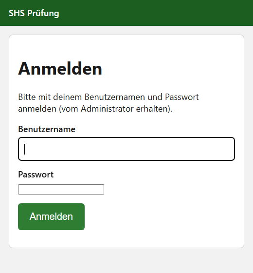</td>
<td width="50%">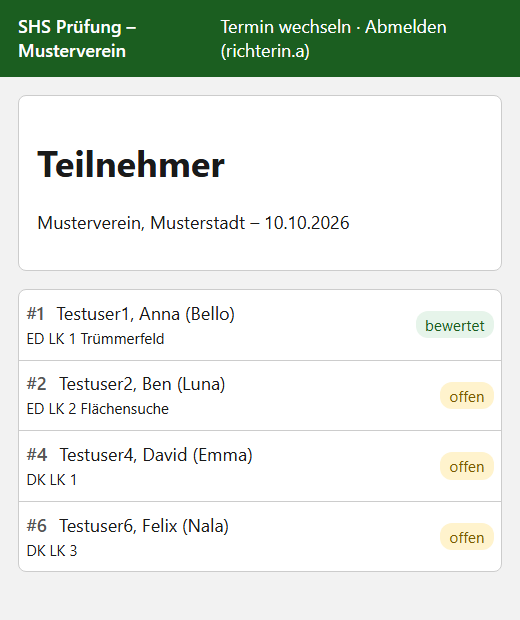</td>
</tr>
</table>

1. **Anmelden** mit Benutzername und Passwort (Groß-/Kleinschreibung beim Benutzernamen egal).
2. **Termin wählen:** Gibt es mehrere veröffentlichte Termine, den richtigen antippen. Bei nur
   einem Termin entfällt dieser Schritt.
3. **Teilnehmerliste:** Jeder Teilnehmer ist mit **„offen“** (gelb) oder **„bewertet“** (grün)
   markiert. Teilnehmer antippen.
4. **Ergebnis eintragen:** Je Disziplin **„Suchleistung (0–60)“** und
   **„Anzeigeleistung (0–40)“** eingeben und **„Speichern“** tippen. Danach geht es zurück zur
   Liste. Beide Felder einer Disziplin leeren und speichern löscht das Ergebnis.
5. **Abmelden** über den Link oben rechts. Nach 12 Stunden ohne Aktivität wirst du automatisch
   abgemeldet.

<table>
<tr>
<td width="50%">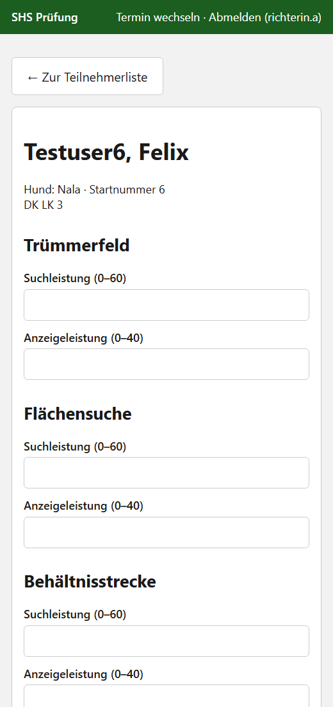</td>
<td width="50%">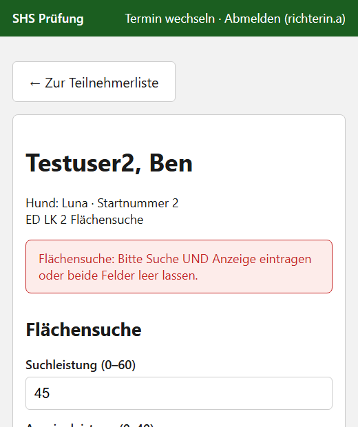</td>
</tr>
</table>

**Fehlermeldungen** erscheinen rot über dem Formular, deine Eingaben bleiben stehen:

- „Bitte bei … nur Zahlen eintragen.“
- „Suchleistung …: nur Werte von 0 bis 60 möglich.“ / „Anzeigeleistung …: nur Werte von 0 bis 40
  möglich.“
- „…: Bitte Suche UND Anzeige eintragen oder beide Felder leer lassen.“

**Gut zu wissen:**

- Beim Dreikampf können mehrere Richter **gleichzeitig** denselben Hund bearbeiten – gespeichert
  wird nur die Disziplin, die du tatsächlich geändert hast.
- **Disqualifikation und Abbruch** lassen sich im Browser nicht eintragen. Gib sie der
  Prüfungsleitung weiter; sie trägt sie im Desktop-Programm ein.

## 12. Für die Prüfungsleitung: Termin im Web veröffentlichen

Die Web-Version ist optional und braucht einen eigenen Server. Die Einrichtung beschreibt
[README_CONTAINER.md](../README_CONTAINER.md). Termin, Teilnehmer, Zeitplan und Druck bleiben im
Desktop-Programm; im Web werden nur Ergebnisse eingetragen.

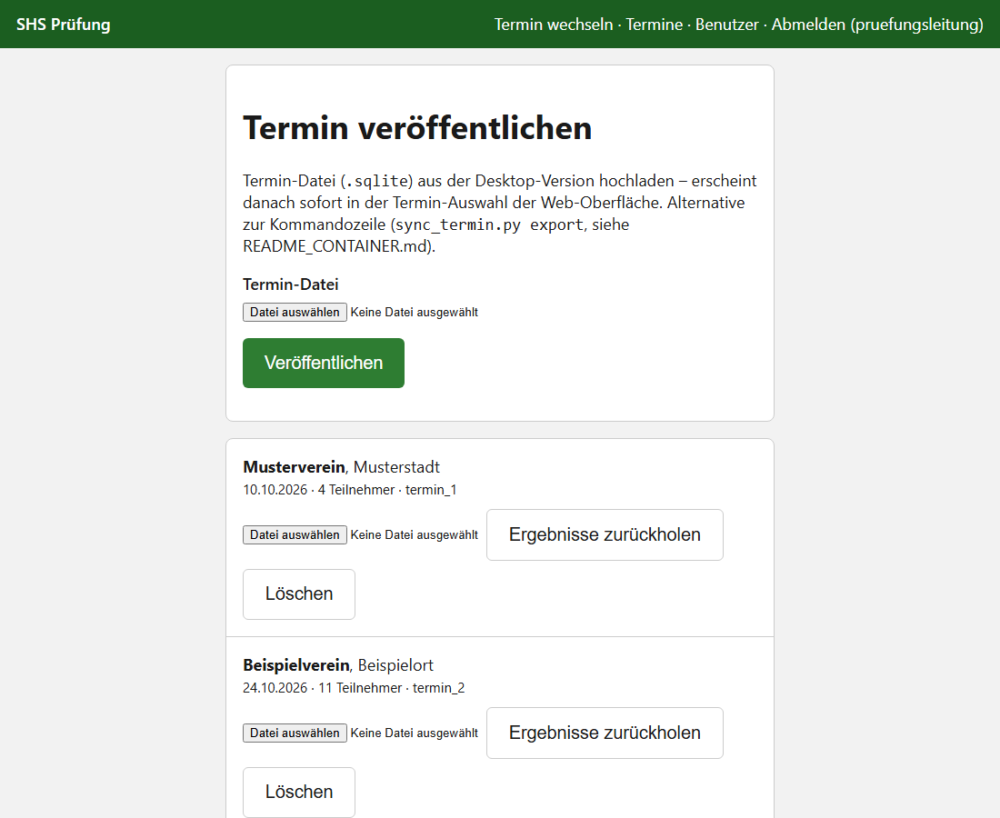

Als Administrator erreichst du oben die Seiten **„Termine“** und **„Benutzer“**.

**Benutzer anlegen:** Unter „Benutzer“ je Richter ein Konto mit der Rolle
**„Nur Eintragen (Ergebnisse erfassen)“** anlegen (Passwort mindestens 8 Zeichen).

**Vor der Prüfung – veröffentlichen:**

1. Alle Teilnehmer haben eine **Startnummer** (der Abgleich läuft darüber).
2. Unter „Termine“ bei **„Termin-Datei“** die `.sqlite`-Datei des Termins aus dem Termine-Ordner
   wählen und **„Veröffentlichen“** klicken.

**Nach der Prüfung – Ergebnisse zurückholen:**

1. **Zuerst** im Desktop-Programm alle Ergebnisse speichern und das Programm schließen (oder
   einen anderen Termin öffnen). Die zurückgeholte Datei entspricht dem Stand beim Hochladen plus
   den Web-Ergebnissen – was du danach noch im Desktop-Programm änderst, ginge beim Ersetzen
   verloren.
2. Beim Termin dieselbe `.sqlite`-Datei wählen und **„Ergebnisse zurückholen“** klicken.
3. Der Bericht zeigt, wie viele Teilnehmer aktualisiert wurden und welche Startnummern
   übersprungen oder nicht gefunden wurden.
4. Die angebotene Datei **herunterladen** – der Link funktioniert nur einmal – und damit die
   ursprüngliche Termin-Datei im Termine-Ordner ersetzen. Achte auf den Dateinamen: Der Browser
   speichert sie meist im Download-Ordner, eventuell mit Zusatz wie „(1)“. Benenne sie dann so
   um wie die ursprüngliche Datei.

Regeln beim Zurückholen: Ergebnisse werden über die **Startnummer** zugeordnet; passen Name oder
Hund nicht zusammen, wird nichts übernommen. Web-Werte überschreiben die Werte in der Datei,
im Web leere Disziplinen behalten den Wert aus der Datei. **Disqualifikation und Abbruch werden
nicht übertragen** und müssen im Desktop-Programm gesetzt werden.

## 13. Häufige Fragen und Probleme

**„Startnummer bereits vergeben“ beim Speichern eines Teilnehmers.**
Die Meldung nennt, wer die Nummer hat. Andere Nummer wählen, „Startnummer steht noch nicht fest“
ankreuzen oder in der Liste „Startnummer tauschen…“ verwenden.

**Ein Termin erscheint im Startbildschirm als „… (nicht lesbar)“, beim Öffnen kommt „Datei beschädigt“.**
Die Datei ist beschädigt oder keine Termin-Datei. Stelle den Termin aus deiner letzten
Datensicherung wieder her („Als Kopie importieren“, wenn du den Stand vergleichen willst).

**Ich habe das Passwort der Datensicherung vergessen.**
Das lässt sich nicht wiederherstellen. Erstelle eine neue Sicherung und notiere das Passwort
sicher.

**Warum ist bei ED nur ein Gegenstand eingebbar?**
Bei einer Einzeldisziplin wird nur in einer Disziplin gesucht – daher gibt es in jeder
Leistungsklasse genau einen Gegenstand (siehe [Kapitel 4](#suchgegenstände)).

**Ich sehe den Termin nach einer Wiederherstellung nicht.**
Wiederhergestellte Termine erscheinen erst beim nächsten „Anderen Termin öffnen…“.

**Kann ich auf mehreren Rechnern arbeiten?**
Ja, über die Datensicherung (siehe [Kapitel 10](#10-datensicherung)). Gleichzeitig am selben
Termin arbeiten geht mit dem Desktop-Programm nicht – dafür gibt es die Web-Version.

### Fehler melden oder Wunsch äußern

Bitte über die [Issues auf GitHub](https://github.com/mbruver-source/SHS/issues/new/choose) mit
den Vorlagen **„Fehler melden“** bzw. **„Idee / Wunsch“**. Hilfreich sind die Programmversion
(Button „Version“), die Schritte bis zum Fehler und ein Screenshot. **Bitte keine echten
Teilnehmerdaten** in Meldungen oder Screenshots.
