# Benutzerhandbuch SHS-Prüfungsprogramm

Dieses Handbuch führt Schritt für Schritt durch einen Prüfungstermin – vom Anlegen über den
Prüfungstag bis zur Datensicherung. Es richtet sich an die **Prüfungsleitung** (Desktop-Programm)
und in [Kapitel 11](#11-für-richter-ergebnisse-im-browser-eintragen) an **Richter**, die Ergebnisse
über die optionale Web-Version eintragen.

Stand: Version 1.0.46. Alle Screenshots zeigen erfundene Testdaten.

- **Zum ersten Mal dabei?** Dann fang mit
  [Kapitel 14: Die erste Prüfung Schritt für Schritt](#14-die-erste-prüfung-schritt-für-schritt)
  an. Unbekannte Wörter erklärt das [Glossar in Kapitel 15](#15-glossar-wörter-kurz-erklärt).
- Umstieg von der LibreOffice-Datei: [UMSTIEG.md](UMSTIEG.md)
- Einrichtung der Web-Version (Server/Container): [README_CONTAINER.md](../README_CONTAINER.md)
- Kurzhilfe im Programm: Button **„❓ Hilfe“** oben rechts
- Programm vorher ausprobieren: Button **„🎓 Demoprüfung“** spielt einen kompletten
  Prüfungstag vor, siehe [Demoprüfung](#demoprüfung); dazu eine Beispiel-CSV mit 20
  erfundenen Teilnehmern, siehe [Ausprobieren mit Beispieldaten](#ausprobieren-mit-beispieldaten)

## Inhalt

1. [Ablauf eines Prüfungstermins](#1-ablauf-eines-prüfungstermins)
2. [Installation und Updates](#2-installation-und-updates)
3. [Termine](#3-termine)
4. [Teilnehmer](#4-teilnehmer)
5. [Formular-Import](#5-formular-import)
6. [Zeitplan](#6-zeitplan)
7. [Ergebniserfassung](#7-ergebniserfassung)
8. [Auswertung und Übersicht](#8-auswertung-und-übersicht)
9. [Verwaltung und Export](#9-verwaltung-und-export)
10. [Datensicherung](#10-datensicherung)
11. [Für Richter: Ergebnisse im Browser eintragen](#11-für-richter-ergebnisse-im-browser-eintragen)
12. [Für die Prüfungsleitung: Termin im Web veröffentlichen](#12-für-die-prüfungsleitung-termin-im-web-veröffentlichen)
13. [Häufige Fragen und Probleme](#13-häufige-fragen-und-probleme)
14. [Die erste Prüfung Schritt für Schritt](#14-die-erste-prüfung-schritt-für-schritt)
15. [Glossar: Wörter kurz erklärt](#15-glossar-wörter-kurz-erklärt)

---

## 1. Ablauf eines Prüfungstermins

| Wann | Was | Wo |
|---|---|---|
| Wochen vorher | Termin anlegen, Veranstaltungsdaten und angebotene Prüfungen eintragen, Anmeldeformular (PDF) erzeugen und mit der Ausschreibung verschicken | Startbildschirm, Reiter „Verwaltung“, „Export“ |
| Mit den Meldungen | Teilnehmer erfassen, Zahlungen abhaken | Reiter „Teilnehmer“, „Formular-Import“ |
| 8 Tage vorher | Zeitplan erstellen, Kontakt zu den Richtern aufnehmen und ihnen den Zeitplan übermitteln (PDF), bei späteren Änderungen erneut senden | Reiter „Zeitplan“ |
| Kurz vorher | Startnummern und Gegenstände prüfen, Bewertungsbögen und Listen drucken | Reiter „Teilnehmer“, „Export“ |
| Am Prüfungstag | Ergebnisse eintragen, regelmäßig speichern | Reiter „Ergebniserfassung“ (oder Web-Version) |
| Danach | Rangliste, Ergebnisliste, Etiketten, Statistik | Reiter „Auswertung“, „Export“ |
| Zum Schluss | Datensicherung erstellen; abgeschlossene Termine später löschen | Reiter „Datensicherung“, Startbildschirm |

Eine ausführliche Anleitung mit jedem einzelnen Klick findest du in
[Kapitel 14](#14-die-erste-prüfung-schritt-für-schritt).

Das Programm arbeitet vollständig **offline**. Internet brauchst du nur für die Update-Suche,
für den optionalen Formular-Import per KI und für die optionale Web-Version.

## 2. Installation und Updates

Alle Dateien gibt es auf der
[Release-Seite](https://github.com/mbruver-source/SHS/releases/latest). Das Programm läuft unter
**Windows**, als **Vorschau** auch unter **macOS** und **Linux**. Die Vorschau-Versionen werden
bei jedem Build automatisch geprüft, sind aber noch nicht auf echten Mac- und Linux-Rechnern
erprobt. Rückmeldungen dazu sind willkommen (siehe
[Fehler melden](#fehler-melden-oder-wunsch-äußern)).

- **Windows:** Die Datei `SHS-Pruefungsprogramm-Setup-X.Y.Z.exe` laden und starten.
  Administratorrechte sind nicht nötig. Weil die Datei noch nicht digital signiert ist, kann
  es zwei einmalige Warnungen geben:

    1. **Der Browser blockiert den Download.** Das Programm ist neu und wird selten
       heruntergeladen, deshalb halten Browser es vorsorglich für verdächtig.
        - **Chrome:** Mit **Strg + J** die Download-Liste öffnen. Bei der Datei auf
          **„Gefährliche Datei behalten“** bzw. **„Trotzdem behalten“** klicken und die
          Rückfrage bestätigen.
        - **Edge:** meldet „… wird häufig nicht heruntergeladen“. Im Download-Fenster oben
          rechts mit der Maus auf die Datei zeigen, auf **„…“** klicken → **„Beibehalten“**.
          Fragt Edge danach noch einmal nach: **„Mehr anzeigen“** →
          **„Trotzdem beibehalten“**.

            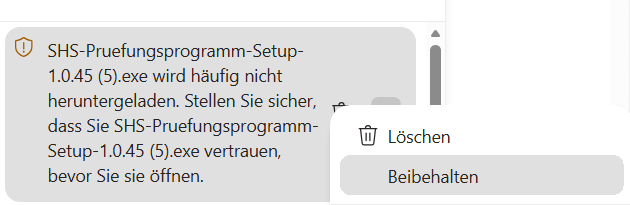

        - **Firefox:** blockiert die Datei normalerweise nicht. Falls doch: in der
          Download-Liste (Pfeil oben rechts) auf die Datei klicken → **„Download erlauben“**.

       Den Schutz des Browsers („Sicheres Browsen“) dafür bitte **nicht** ausschalten.

    2. **Windows warnt beim Start.** Erscheint „Windows hat den Start dieser App verhindert“,
       auf **„Weitere Informationen“** → **„Trotzdem ausführen“** klicken.

- **macOS (Vorschau, ab macOS 13):** Es gibt zwei Dateien. Welche passt, steht im Apple-Menü
  unter **„Über diesen Mac“**: Bei „Chip Apple M…“ die Datei
  `SHS-Pruefungsprogramm-X.Y.Z-macOS-AppleSilicon.dmg`, bei „Prozessor Intel …“ die Datei
  `…-macOS-Intel.dmg`.

    1. Die `.dmg`-Datei öffnen und **SHS-Pruefungsprogramm** auf den Ordner **„Programme“**
       ziehen.
    2. Das Programm ist nicht bei Apple registriert. Beim ersten Start meldet macOS deshalb,
       dass es nicht überprüft werden kann. Auf **„Fertig“** klicken.
    3. **Systemeinstellungen** → **„Datenschutz & Sicherheit“** öffnen, ganz nach unten
       scrollen und bei SHS-Pruefungsprogramm auf **„Dennoch öffnen“** klicken, dann mit dem
       Passwort bestätigen. Ab jetzt startet das Programm normal. (Bis macOS 14 genügt
       stattdessen: Rechtsklick auf das Programm → **„Öffnen“** → **„Öffnen“**.)

- **Linux (Vorschau):** für alle gängigen Distributionen ab etwa 2022 (z. B. Ubuntu 22.04,
  Linux Mint 21, Debian 12), nur für 64-Bit-PCs (x86_64).

    - **AppImage** (läuft ohne Installation): `SHS-Pruefungsprogramm-X.Y.Z-x86_64.AppImage`
      laden, mit Rechtsklick → **„Eigenschaften“** als **ausführbar** markieren (oder im
      Terminal `chmod +x SHS-Pruefungsprogramm-*.AppImage`) und per Doppelklick starten.
      Startet es nicht, fehlt meist FUSE: das Paket `fuse3` installieren.
    - **.deb-Paket** (Ubuntu, Mint, Debian, mit Eintrag im Startmenü):
      `shs-pruefungsprogramm_X.Y.Z_amd64.deb` laden und per Doppelklick in der
      Softwareverwaltung installieren oder im Terminal:
      `sudo apt install ./shs-pruefungsprogramm_X.Y.Z_amd64.deb`. Entfernen mit
      `sudo apt remove shs-pruefungsprogramm`, die Termine bleiben dabei erhalten.

- **Version prüfen und aktualisieren:** Oben rechts auf **„ℹ️ Version …“** klicken, dann
  **„Nach Updates suchen“**. Gibt es eine neuere Version, erscheint
  **„Neue Version herunterladen (GitHub öffnen)“**. Die neue Version einfach über die alte
  installieren – deine Termine bleiben erhalten. Unter macOS die App im Ordner „Programme“
  ersetzen, beim AppImage die alte Datei durch die neue. Eine automatische Suche im
  Hintergrund gibt es bewusst nicht.
- **Vor dem Update das Programm schließen.** Beim Schließen werden offene Ergebnisse wie
  gewohnt gespeichert. Ab Version 1.0.44 erkennt das Setup ein noch laufendes Programm und
  bittet, es zu schließen. Meldet das Setup „Fehler beim Ersetzen einer vorhandenen Datei …
  Zugriff verweigert“, läuft das Programm noch: Programm schließen, dann
  **„Nochmals versuchen“** klicken.
- **Aussehen:** Im Menü **„Ansicht“** gibt es zwei Einstellungen, die sich frei kombinieren
  lassen und gespeichert werden:
  - **„Hintergrund“:** Hell (Standard), Warm / Sand, Dunkel oder Hoher Kontrast. Hoher
    Kontrast eignet sich z. B. für einen Laptop draußen am Prüfungstag.
  - **„Akzentfarbe“:** Blau, Grün oder Violett, die Farbe der Haupt-Schaltflächen und der
    Markierungen.

  Unter Windows bleibt beim Design Dunkel das Fenster zum Öffnen und Speichern von Dateien
  hell. Dieses Fenster stammt von Windows selbst.

## 3. Termine

Jeder Prüfungstermin ist eine eigene Datei. Standardmäßig liegen alle Termine im Ordner
`SHS-Pruefungsprogramm\Termine` in deinem Benutzerprofil (z. B.
`C:\Users\Name\SHS-Pruefungsprogramm\Termine`, unter macOS
`/Users/Name/SHS-Pruefungsprogramm/Termine`, unter Linux
`/home/Name/SHS-Pruefungsprogramm/Termine`).

### Startbildschirm

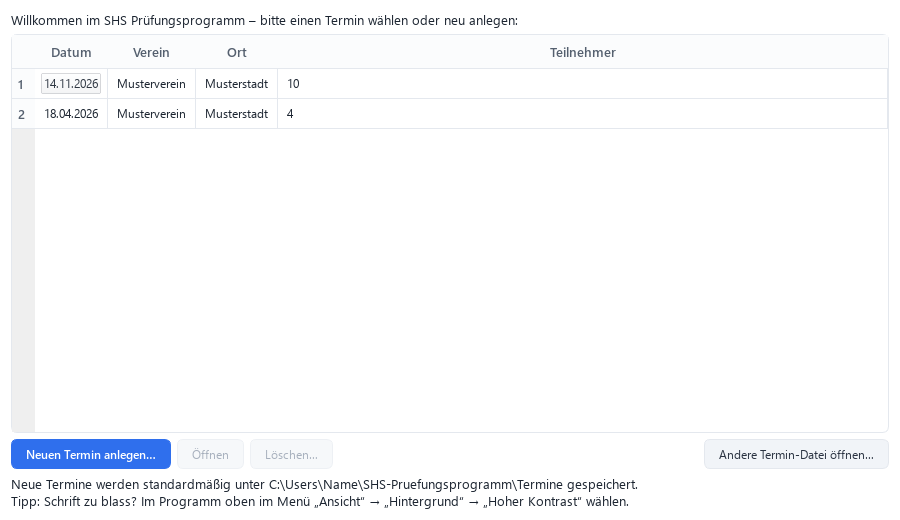

Beim Programmstart siehst du alle Termine mit Datum, Verein, Ort und Teilnehmerzahl, der neueste
steht oben.

| Button | Wirkung |
|---|---|
| **„Neuen Termin anlegen…“** | Öffnet die Eingabe der Veranstaltungsdaten (siehe unten). Verein, Vereins-Nr., Ort und Verband werden vom neuesten Termin übernommen. |
| **„Öffnen“** (oder Doppelklick) | Öffnet den markierten Termin. |
| **„Löschen…“** | Löscht den markierten Termin nach Rückfrage **unwiderruflich**, mit allen Teilnehmer- und Ergebnisdaten. Der gerade geöffnete Termin lässt sich nicht löschen. Bereits erzeugte PDFs im Ordner `Ausdrucke` bleiben bewusst erhalten – bei Bedarf dort von Hand löschen. |
| **„Andere Termin-Datei öffnen…“** | Öffnet eine Termin-Datei (`*.sqlite`) von einem anderen Ort, z. B. einem USB-Stick. |
| **„🎓 Demoprüfung“** (oben rechts) | Spielt einen kompletten Prüfungstag mit erfundenen Daten vor, siehe [Demoprüfung](#demoprüfung). |

Im Hauptfenster wechselst du jederzeit über **„Anderen Termin öffnen…“** oben rechts.

### Demoprüfung

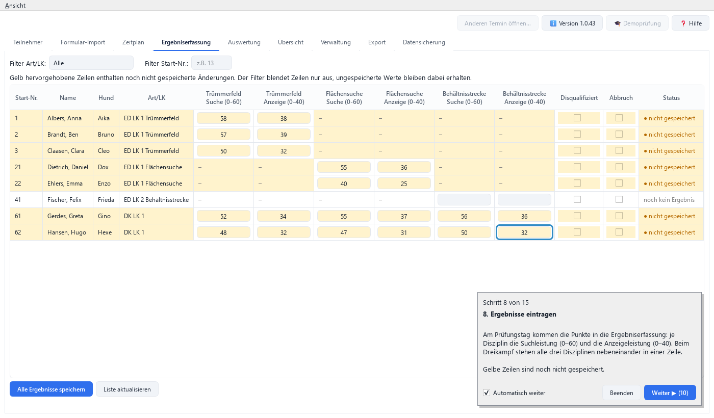

Der Button **„🎓 Demoprüfung“** steht im Startbildschirm und im Hauptfenster oben rechts neben
**„❓ Hilfe“**. Die Demo spielt einmal einen ganz normalen Prüfungstag vor:

1. Termin anlegen (das Fenster „Neuen Termin anlegen“ füllt sich von selbst),
2. einen Teilnehmer in der Erfassungsmaske eintragen, sieben weitere Meldungen kommen dazu,
3. Startnummern vergeben und abhaken, wer bezahlt hat,
4. den Zeitplan automatisch verteilen,
5. Ergebnisse eintragen, eine Disqualifikation setzen und speichern,
6. die Auswertung ansehen und ein Stechen entscheiden,
7. die Ergebnisliste als PDF erzeugen (**„PDF öffnen“** zeigt sie),
8. ein Hinweis, wie Richter am Tablet eintragen können,
9. den Demo-Termin wieder löschen.

Das Programm klickt und tippt dabei selbst. Ein kleines Fenster erklärt jeden Schritt: was
gerade passiert und warum. Ein farbiger Rahmen zeigt, wo gearbeitet wird. Du klickst auf
**„Weiter ▶“** oder lässt die Demo laufen, mit **„Beenden“** brichst du jederzeit ab.

Das Programm tippt in normalem Tempo, wie von Hand. Wer es eilig hat, drückt einfach
**„Weiter ▶“**: Dann wird der laufende Schritt sofort fertig ausgefüllt.

Ist ein Schritt fertig, zählt der Knopf zehn Sekunden herunter („Weiter ▶ (10)“) und
schaltet dann von allein weiter. So läuft die Demo auch ohne Zutun durch. Wer lieber selbst
klickt, nimmt den Haken bei **„Automatisch weiter“** heraus.

- Schaust du die Ergebnisliste über **„PDF öffnen“** an oder tippst bzw. klickst du selbst in
  einem Fenster der Demo, hält der Countdown für diesen Schritt an. Im Erklärfenster steht
  dann „Automatisch weiter angehalten“, weiter geht es mit **„Weiter ▶“**.
- Ist eine Meldung oder Rückfrage des Programms offen, wartet der Countdown nur. Nach dem
  Schließen zählt er von allein weiter, mit mindestens drei Sekunden Vorlauf.
- Im letzten Schritt wartet die Demo, bis du auf **„Fertig ✔“** klickst.

Alle Namen und Daten sind erfunden. Der Demo-Termin liegt in einem temporären Ordner, nicht
bei deinen Terminen, und wird am Ende samt PDF gelöscht. Ist die Ergebnisliste dann noch in
einem PDF-Programm geöffnet, räumt das Programm sie beim nächsten Start weg. Deine echten Termine bleiben
unberührt. Der Reiter **„Datensicherung“** ist während der Demo gesperrt, weil er immer mit
deinen echten Terminen arbeitet. Startest du die Demo aus dem Hauptfenster, bist du danach
wieder in deinem vorherigen Termin. Gibt es dort noch nicht gespeicherte Ergebnisse, fragt das
Programm vorher wie beim Terminwechsel nach.

### Neuen Termin anlegen

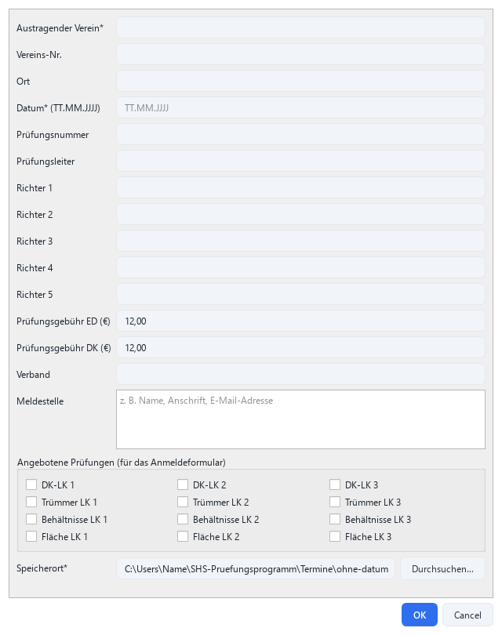

Pflicht sind **Austragender Verein\*** und **Datum\*** (TT.MM.JJJJ). Alle weiteren Angaben –
Vereins-Nr., Ort, Prüfungsnummer, Prüfungsleiter, Richter 1–5, Prüfungsgebühr ED/DK – kannst
du auch später im Reiter „Verwaltung“ nachtragen. Sie erscheinen im Kopf der Statistik und in
der Übersicht für die Prüfungsleitung.

**Verband**, **Meldestelle** (mehrzeilig, z. B. Name, Anschrift, E-Mail) und **Angebotene
Prüfungen** (12 Haken: DK, Trümmer, Behältnisse und Fläche, jeweils LK 1–3) brauchst du für das
ausfüllbare Anmeldeformular (siehe [Kapitel 5](#5-formular-import)). Bleiben Verband oder
Meldestelle beim Anlegen leer, weist das Programm darauf hin – du kannst trotzdem speichern
und sie später nachtragen. Der Dialog lässt sich scrollen und vergrößern.

Unter **Startnummern-Bereiche** trägst du je angebotener Prüfung einen Nummernbereich ein,
z. B. DK-LK 1: 1 bis 20, Trümmer LK 1: 21 bis 40. Daraus vergibt „Fehlende Startnummern
vergeben…“ (siehe [Kapitel 4](#4-teilnehmer)) die Nummern. Bereiche dürfen sich nicht
überschneiden; eine Prüfung ohne Bereich bekommt keine automatische Nummer. Bei einem neuen
Termin werden die Bereiche des letzten Termins vorgeschlagen.

Schneller geht es mit **„Bereiche automatisch festlegen“**: Unter **„Standardgröße je
Prüfung“** stellst du ein, wie viele Nummern eine Prüfung bekommt (z. B. 20), und
übernimmst sie mit **„Für alle übernehmen“** in die Spalte **„Anzahl“**. Dort kannst du
einzelne Prüfungen noch anpassen; „keine“ heißt: kein Bereich. Der Knopf vergibt die
Bereiche dann lückenlos ab 1 in der Reihenfolge der Liste. Sind nur Trümmer LK 1 und
Fläche LK 1 angeboten, ergibt das mit je 20 also 1–20 und 21–40. Er **überschreibt** die
Bereiche aller angebotenen Prüfungen; danach
kannst du einzelne von Hand ändern. Die „Anzahl“ geht dabei mit, und leerst du „von“ und
„bis“, steht sie auf „keine“. Die Standardgröße wird gespeichert und beim nächsten
Termin vorgeschlagen.

Der **Speicherort\*** wird automatisch als `JJJJ-MM-TT_Verein.sqlite` vorgeschlagen. Behalte
den Vorschlag möglichst bei: Nur Termine im Standardordner erscheinen im Startbildschirm und
werden von der Datensicherung erfasst.

## 4. Teilnehmer

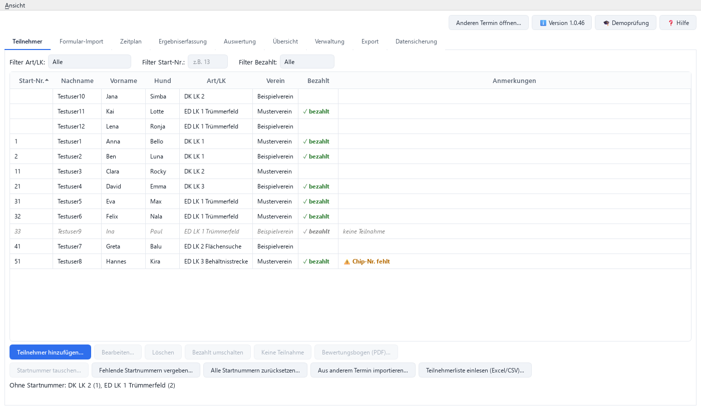

Die Liste zeigt Startnummer, Name, Hund, Art/LK, Verein, Bezahlt-Status und **Anmerkungen**.
Ein Klick auf eine Spaltenüberschrift sortiert. Die Filter **„Filter Art/LK“**,
**„Filter Start-Nr.“** und **„Filter Bezahlt“** blenden Zeilen nur aus.

| Button | Wirkung |
|---|---|
| **„Teilnehmer hinzufügen…“** | Öffnet die Erfassungsmaske. Die Startnummer bleibt zunächst offen (siehe unten). |
| **„Bearbeiten…“** | Öffnet die Maske für den markierten Teilnehmer – ebenso ein Doppelklick auf die Zeile. |
| **„Löschen“** | Löscht die markierten Teilnehmer nach einer Rückfrage, inklusive Ergebnis – auch mehrere auf einmal. |
| **„Bezahlt umschalten“** | Setzt oder entfernt „✓ bezahlt“ sofort, ohne die Maske zu öffnen. Wirkt auf alle markierten Teilnehmer (mehrere mit Strg- oder Umschalt-Klick markieren): Sind schon alle bezahlt, wird „bezahlt“ bei allen entfernt, sonst bei allen gesetzt. |
| **„Keine Teilnahme“** | Markiert nicht erschienene Teilnehmer (siehe unten), auch mehrere auf einmal. Sind alle markierten bereits so vermerkt, heißt der Button **„Teilnahme wiederherstellen“**. |
| **„Startnummer tauschen…“** | Tauscht die Startnummern zweier Teilnehmer in einem Schritt: entweder beide Teilnehmer markieren (Strg-Klick) oder einen markieren und den Partner im Fenster wählen. |
| **„Fehlende Startnummern vergeben…“** | Vergibt allen Teilnehmern **ohne** Startnummer die nächste freie Nummer im Bereich ihrer Prüfung, bei gesetztem „Filter Art/LK“ nur in dieser Prüfung (siehe unten). |
| **„Alle Startnummern zurücksetzen…“** | Entfernt nach einer Rückfrage die Startnummern **aller** Teilnehmer bzw. bei gesetztem „Filter Art/LK“ nur die dieser Prüfung, z. B. um sie nach geänderten Bereichen neu zu vergeben (siehe unten). |
| **„Aus anderem Termin importieren…“** | Übernimmt Teilnehmer aus einem früheren Termin (siehe unten). |
| **„Teilnehmerliste einlesen (Excel/CSV)…“** | Liest eine Excel-Liste (als CSV gespeichert) ein, siehe [Kapitel 5](#5-formular-import). |
| **„Bewertungsbogen (PDF)…“** | Erzeugt sofort den Bewertungsbogen nur für den markierten Teilnehmer. |

### Startnummern vergeben

Am bequemsten vergibst du die Startnummern gesammelt, z. B. nach dem Einlesen der
Anmeldungen:

1. In den Veranstaltungsdaten (Reiter „Verwaltung“ → „Veranstaltungsdaten bearbeiten…“) je
   Prüfung einen **Startnummern-Bereich** eintragen (siehe [Kapitel 3](#3-termine)).
2. Im Reiter „Teilnehmer“ auf **„Fehlende Startnummern vergeben…“** klicken. Nach jedem
   Import fragt das Programm auch von selbst danach.

Vergeben wird nur an Teilnehmer **ohne** Nummer, sortiert nach Prüfung und darin nach Name.
Bereits vergebene Nummern bleiben unverändert, Teilnehmer mit „Keine Teilnahme“ werden
übersprungen. Wer keine Nummer bekommt (kein Bereich hinterlegt oder Bereich voll), steht in
der Meldung danach. Einzelne Nummern änderst du über „Bearbeiten…“ oder „Startnummer
tauschen…“.

Willst du **alle** Nummern neu vergeben, etwa nach geänderten Bereichen, klickst du zuerst
auf **„Alle Startnummern zurücksetzen…“** und dann auf „Fehlende Startnummern vergeben…“.
Das solltest du nur vor der Prüfung tun: Der Zeitplan richtet sich nach den Startnummern,
und im Web erfasste Ergebnisse werden beim Zurückholen über die Startnummer zugeordnet.

Ist im **„Filter Art/LK“** eine Prüfung gewählt, wirken beide Knöpfe nur auf diese Prüfung,
z. B. nur auf „ED LK 1 Trümmerfeld“. Rückfrage und Meldung nennen die Prüfung dann
ausdrücklich. Die Filter „Start-Nr.“ und „Bezahlt“ haben darauf keinen Einfluss.

Unter den Knöpfen steht, in welchen Prüfungen noch Teilnehmer **ohne Startnummer** sind,
z. B. „Ohne Startnummer: DK LK 2 (1), ED LK 1 Trümmerfeld (2)“. Der Hinweis zeigt immer alle
Prüfungen, auch bei gesetztem Filter, und verschwindet, sobald alle eine Nummer haben.
Teilnehmer mit „Keine Teilnahme“ zählen nicht mit.

### Nicht erschienene Teilnehmer („Keine Teilnahme“)

Erscheint ein Teilnehmer nicht, markierst du ihn und klickst auf **„Keine Teilnahme“**.
Er bleibt in der Teilnehmerliste, wird aber grau und kursiv dargestellt, und unter
„Anmerkungen“ steht „keine Teilnahme“. Seine Startnummer bleibt vergeben.

In allen weiteren Schritten kommt er nicht mehr vor: Zeitplan, Ergebniserfassung,
Auswertung (er zählt auch nicht bei „von X Startern“), Übersicht und Behältnis-Bedarf,
Bewertungsbögen, Ergebnislisten, Etiketten, Statistik, Chipnummernliste und
Leistungsrichter-Bedarf. Beim Veröffentlichen im Web wird er nicht übertragen. Markierst
du ihn erst, nachdem der Termin schon veröffentlicht ist, sehen die Richter ihn im Browser
weiter: Veröffentliche den Termin dann erneut.
Nur die **„Übersicht für Prüfungsleitung“** führt ihn weiter, mit dem Vermerk
„keine Teilnahme“, denn die Prüfungsgebühr kann trotzdem fällig sein.

Sind für den Teilnehmer schon Ergebnisse erfasst, fragt das Programm vorher nach. Die
Ergebnisse bleiben gespeichert und zählen wieder, sobald du
**„Teilnahme wiederherstellen“** klickst.

### Die Erfassungsmaske

Pflichtfelder sind mit \* markiert: **Nachname\***, **Vorname\***, **Rufname Hund\***,
**Art\*** (ED = Einzeldisziplin, DK = Dreikampf) und **Leistungsklasse\*** (1–3). Bei ED wählst
du zusätzlich die **Disziplin** (Trümmerfeld, Flächensuche oder Behältnisstrecke). Alle anderen
Felder sind optional. Datumsfelder nehmen TT.MM.JJJJ an.

- **Startnummer:** Neue Teilnehmer starten mit dem Häkchen **„Startnummer steht noch nicht
  fest“**. Entfernst du es, schlägt das Programm die kleinste freie Nummer im Bereich der
  gewählten Prüfung vor. Eine bereits vergebene Nummer lehnt das Programm ab und nennt, wer sie
  hat.
- **Halter:** Weicht der Hundeeigentümer vom Hundeführer ab, das Häkchen
  **„Halter weicht vom Hundeführer ab“** setzen – dann erscheinen die Halter-Felder.
- **Prüfungsgebühr bezahlt:** Häkchen in der Maske oder später „Bezahlt umschalten“.

### Suchgegenstände

Hinter jedem Gegenstand legst du bei **„gesucht in:“** fest, in welcher Disziplin er gesucht wird.
Das bestimmt, auf welchem Bewertungsbogen er erscheint.

**Einzeldisziplin (ED):** Es gibt nur eine Suchdisziplin und deshalb – in jeder Leistungsklasse –
genau **einen** Gegenstand. Nur **Gegenstand 1** ist eingabebereit, „gesucht in“ folgt
automatisch der gewählten Disziplin. Gegenstand 2 und 3 sind ausgegraut.

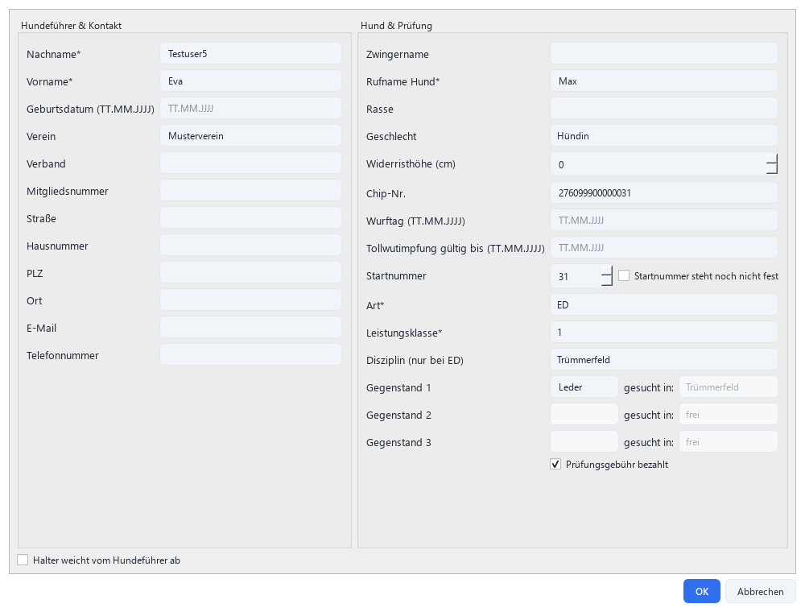

**Dreikampf (DK):** Alle drei Felder sind frei wählbar. Mindestens nötig sind unterschiedliche
Gegenstände je Leistungsklasse:

| Leistungsklasse | Mindestens |
|---|---|
| DK LK 1 | 1 Gegenstand |
| DK LK 2 | 2 verschiedene Gegenstände |
| DK LK 3 | 3 verschiedene Gegenstände |

- Du kannst alle Gegenstände auf **„frei“** lassen – dann genügt die Mindestanzahl.
- Ordnest du Disziplinen zu, sollten alle drei Disziplinen belegt sein. Derselbe Gegenstand darf
  dafür in mehreren Feldern stehen (z. B. LK 1: dreimal „Schlüsselbund“, je mit einer anderen
  Disziplin).
- Jede Disziplin darf nur **einem** Feld zugeordnet sein, sonst erscheint
  „Gegenstand-Zuordnung doppelt vergeben“.

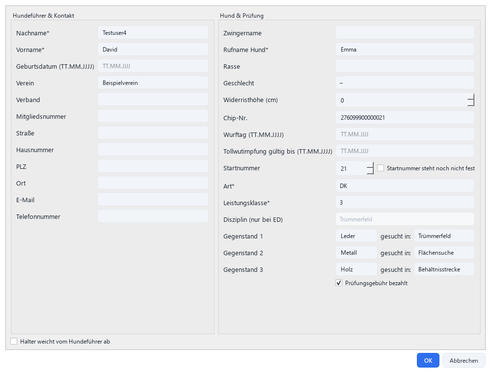

### Spalte „Anmerkungen“

Die Spalte zeigt, ob für die Prüfung noch etwas fehlt. **Warnungen** (orange, fett, mit ⚠)
solltest du vor dem Prüfungstag beheben; **Hinweise** (klein) sind nur Erinnerungen.

| Meldung | Art | Bedeutung |
|---|---|---|
| ⚠ Chip-Nr. fehlt | Warnung (orange) | Keine Chipnummer eingetragen – wird am Prüfungstag zur Identifizierung gebraucht. |
| Gegenstand noch offen | Hinweis (grau) | ED ohne Gegenstand. Kann bis zum Prüfungstag nachgetragen werden. |
| Gegenstände noch offen | Hinweis (grau) | DK mit weniger verschiedenen Gegenständen als die Mindestanzahl. Kann bis zum Prüfungstag nachgetragen werden. |
| Gegenstände den Suchdisziplinen nicht vollständig zugeordnet | Hinweis | DK: Die Zuordnung ist begonnen, deckt aber nicht alle drei Disziplinen ab. |
| Gegenstand der Suchdisziplin nicht zugeordnet | Hinweis | ED (ältere Daten): Gegenstand ohne Zuordnung. Einmal öffnen und speichern behebt das. |
| Bei ED ist nur ein Gegenstand vorgesehen | Hinweis | ED mit mehreren Gegenständen, z. B. aus älteren Daten. Beim nächsten Speichern fragt das Programm nach, bevor es die überzähligen entfernt. |
| keine Teilnahme | Vermerk | Teilnehmer ist als nicht erschienen markiert, die ganze Zeile ist grau (siehe oben). Weitere Meldungen stehen dahinter. |

### Teilnehmer aus einem früheren Termin übernehmen

**„Aus anderem Termin importieren…“** zeigt die übrigen Termine zur Auswahl und darunter deren
Teilnehmer mit Häkchen (**„Alle auswählen“** / **„Keine auswählen“**). Übernommen werden nur die
**Stammdaten** einschließlich Art, Leistungsklasse und Disziplin – nicht Startnummer,
Gegenstände, Bezahlt-Status und Ergebnis. Es gibt keine Dublettenprüfung: Wer schon im Termin
steht, wird bei erneutem Import ein zweites Mal angelegt.

## 5. Formular-Import

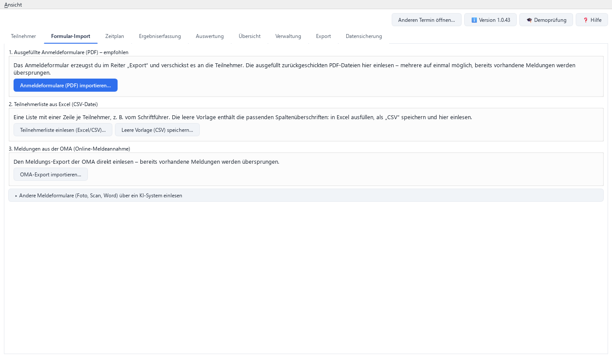

Der Reiter zeigt drei Wege, Teilnehmer einzulesen – jeweils mit kurzer Erklärung:
**1. Ausgefüllte Anmeldeformulare (PDF)**, **2. Teilnehmerliste aus Excel (CSV-Datei)** und
**3. Meldungen aus der OMA**. Darunter lässt sich der Weg **über ein KI-System** (Foto, Scan,
Word) aufklappen. Nach jedem Import fragt das Programm, ob es fehlende Startnummern gleich
vergeben soll (siehe [Kapitel 4](#4-teilnehmer)).

### Ausfüllbares Anmeldeformular (PDF) – empfohlen

Importieren lässt sich **nur das Anmeldeformular, das dieses Programm selbst erzeugt** (Reiter
„Export“ → „Anmeldeformular (PDF)…“), und zwar aus **demselben Termin**, in den du importierst.
Nur dieses PDF enthält die Formularfelder, die der Import ausliest. So sieht es aus – Kopf mit
den Termindaten, ohne Vereins- oder Verbandslogos, ankreuzbar nur die angebotenen Prüfungen:

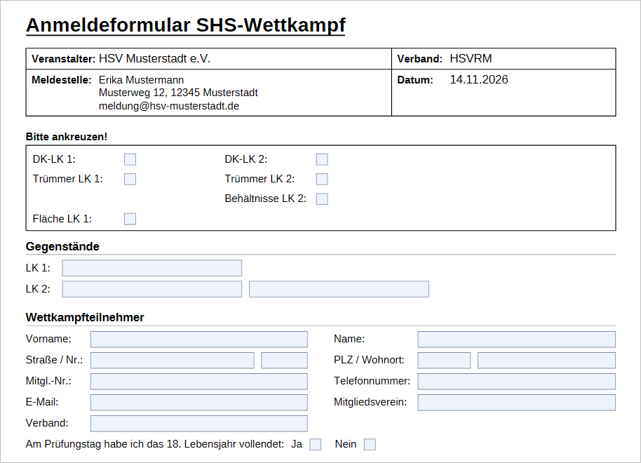

**Nicht** importieren lassen sich: das frühere Word-Anmeldeformular (auch nicht als PDF
gespeichert), Scans und Fotos, ausgedruckte und von Hand ausgefüllte Formulare sowie ein
Formular, das über „Drucken → Als PDF speichern“ weitergegeben wurde – dabei gehen die
Formularfelder verloren. Für diese Fälle gibt es den Weg [per KI](#per-ki-foto-scan-word) weiter
unten.

**Schritt für Schritt:**

1. **Termin vorbereiten:** Im Reiter „Verwaltung“ unter „Veranstaltungsdaten bearbeiten…“
   Verband, Meldestelle und die **angebotenen Prüfungen** eintragen.
2. **Formular erzeugen:** Im Reiter „Export“ mit **„Anmeldeformular (PDF)…“** das PDF
   speichern und mit der Ausschreibung an die Teilnehmer verschicken. Veranstalter, Verband,
   Meldestelle, Datum und Ort sind eingedruckt.
3. **Ausfüllen lassen:** Die Teilnehmer füllen das PDF am Rechner aus (Adobe Acrobat Reader,
   Browser wie Edge/Chrome/Firefox o. Ä.), kreuzen **genau eine** Prüfung an, **speichern** es
   (nicht „Drucken → Als PDF“) und schicken die Datei zurück.
4. **Einlesen:** Hier im Reiter „Formular-Import“ mit **„Anmeldeformulare (PDF)
   importieren…“** die zurückgeschickten Dateien auswählen – mehrere auf einmal sind möglich.
   Danach erscheint eine Übersicht: importiert, bereits vorhanden, nicht importiert (mit Grund).

- **Je Formular genau eine Prüfung.** Sind mehrere oder keine angekreuzt, wird das Formular
  nicht übernommen und im Ergebnis mit Grund aufgeführt.
- **Nur Prüfungen dieses Termins.** Ist eine Prüfung angekreuzt, die der geöffnete Termin nicht
  anbietet (z. B. ein Formular vom Vorjahr oder der falsche Termin geöffnet), wird das Formular
  abgelehnt. Kläre das dann mit dem Teilnehmer – nur wenn die Prüfung tatsächlich angeboten
  werden soll, ergänzt du sie im Reiter „Verwaltung“ → „Veranstaltungsdaten bearbeiten…“.
- **Datumsangaben** (Wurfdatum, Tollwutimpfung) müssen als TT.MM.JJJJ, die Größe als ganze Zahl
  (z. B. „45“ oder „45 cm“) eingetragen sein. Sonst wird das ganze Formular mit Grund abgelehnt –
  dann den Teilnehmer um Korrektur bitten oder ihn im Reiter „Teilnehmer“ von Hand anlegen.
  Ebenso abgelehnt wird ein Formular, bei dem Vorname, Name oder Rufname des Hundes fehlt oder
  Hündin und Rüde beide angekreuzt sind.
- **Übernommen:** alle Angaben zu Teilnehmer, abweichendem Hundeeigentümer und Hund sowie die
  Gegenstände der angekreuzten Leistungsklasse (ohne Zuordnung zu einer Disziplin). Bei einer
  **Einzeldisziplin** gibt es nur einen Gegenstand: Übernommen wird der erste ausgefüllte,
  weitere nennt die Übersicht nach dem Import als „nicht übernommen“. Das Formular weist
  darauf auch selbst hin. Die Nummer landet in der Chip-Nr.; ist Täto-Nr. und nicht zugleich
  Chip-Nr. angekreuzt, steht dort „Täto …“.
- **Nicht übernommen:** die Angabe „18. Lebensjahr vollendet“ und das Datum neben der
  Unterschrift. Startnummer und Bezahlt-Status trägst du wie gewohnt im Reiter „Teilnehmer“ nach.
- **Erneuter Import:** Eine Meldung mit gleichem Namen, Hund, Art, Leistungsklasse und Disziplin
  wird nicht noch einmal angelegt.

### Teilnehmerliste aus Excel übernehmen

Eine Liste mit einer Zeile je Teilnehmer – z. B. vom Schriftführer – liest du mit
**„Teilnehmerliste einlesen (Excel/CSV)…“** ein (Abschnitt 2 im Reiter „Formular-Import“; denselben
Knopf gibt es auch im Reiter „Teilnehmer“).

1. **„Leere Vorlage (CSV) speichern…“** klicken – die Datei enthält die passenden
   Spaltenüberschriften (nachname, vorname, rufname_hund, art, stufe, disziplin, …).
2. Die Vorlage in Excel öffnen, je Teilnehmer eine Zeile ausfüllen und wieder **als CSV**
   speichern („CSV UTF-8“ oder „CSV (Trennzeichen-getrennt)“ – beides wird erkannt).
3. Die Datei mit **„Teilnehmerliste einlesen (Excel/CSV)…“** auswählen.

Pflicht sind Nachname, Vorname, Rufname des Hundes, Art (ED oder DK), Leistungsklasse (1–3) und
bei ED die Disziplin (Trümmerfeld, Flächensuche oder Behältnisstrecke). Eine mit
**„Teilnehmerliste speichern (CSV, für Excel)…“** (Reiter „Export“) gespeicherte Liste lässt sich ebenso
wieder einlesen.

### Per KI (Foto, Scan, Word)

Ausgefüllte Meldeformulare (PDF, Word oder Foto/Scan) lassen sich mit einem KI-Assistenten
(z. B. Claude oder ChatGPT) in eine CSV-Datei umwandeln. Dazu im Reiter „Formular-Import“ unten
**„Andere Meldeformulare (Foto, Scan, Word) über ein KI-System einlesen“** aufklappen:

1. **„Prompt kopieren“** klicken.
2. Im KI-Assistenten den Prompt einfügen und die Meldeformulare anhängen.
3. Die erzeugte CSV-Datei speichern und mit **„Teilnehmerliste einlesen (Excel/CSV)…“** einlesen.

Für beide CSV-Wege gilt: Jede Zeile wird ein neuer Teilnehmer – außer er ist schon gemeldet (gleicher Name, Hund,
Art, Leistungsklasse und Disziplin; dann wird er übersprungen und genannt). Startnummer, Gegenstände und Bezahlt-Status
sind nicht enthalten, diese trägst du danach im Reiter „Teilnehmer“ nach. Fehlerhafte Zeilen werden übersprungen und nach
dem Import mit Zeilennummer und Grund aufgelistet, z. B. fehlende Pflichtangaben, Art nicht
ED/DK, Leistungsklasse nicht 1–3, ED ohne gültige Disziplin oder ein ungültiges Datum. Wie beim
PDF-Import werden auch Zeilen mit einer Prüfung abgelehnt, die der Termin nicht anbietet. Sind im
Termin noch gar keine angebotenen Prüfungen hinterlegt, wird das nicht geprüft – darauf weist
die Meldung nach dem Import hin. Komma oder Semikolon als Trennzeichen sowie UTF-8- und
Windows-Kodierung (wie von Excel gespeichert) werden erkannt.

> **Datenschutz:** Beim Import per KI gehen die Meldeformulare an den gewählten KI-Anbieter.
> Kläre vorher, ob das für deinen Verein in Ordnung ist. Das Programm selbst sendet nichts.

### Ausprobieren mit Beispieldaten

Um das Programm vor dem ersten echten Termin gefahrlos zu testen, gibt es eine Beispieldatei
mit 20 frei erfundenen Teilnehmern (Einzeldisziplin in allen Leistungsklassen und Disziplinen
sowie Dreikampf):
[beispiel_teilnehmer.csv](https://mbruver-source.github.io/SHS/beispiel_teilnehmer.csv)
(im Browser ggf. mit Rechtsklick → „Ziel speichern unter…“ herunterladen).

1. Einen neuen Test-Termin anlegen (siehe [Kapitel 3](#3-termine)) und dabei alle
   „Angebotenen Prüfungen“ ankreuzen (oder keine) – sonst werden Teilnehmer in nicht
   angebotenen Prüfungen beim Einlesen abgelehnt.
2. Im Reiter „Formular-Import“ mit **„Teilnehmerliste einlesen (Excel/CSV)…“** die Beispieldatei einlesen – alle 20
   Teilnehmer werden übernommen.
3. Startnummern vergeben – die CSV enthält sie nicht: nach dem Import die Frage „Jetzt
   vergeben?“ mit Ja beantworten (dafür vorher Startnummern-Bereiche eintragen, siehe oben)
   oder einzeln über **„Bearbeiten…“**. Gegenstände bei Bedarf ebenfalls über „Bearbeiten…“.
4. Danach lassen sich Zeitplan, Ergebniserfassung, Auswertung und PDF-Ausgaben ausprobieren.

Den Test-Termin danach im Startbildschirm wieder löschen. Solange er geöffnet ist, lässt er
sich nicht löschen – vorher einen anderen Termin öffnen oder das Programm neu starten.

### Meldungen aus der OMA übernehmen

Den Meldungs-Export der OMA (Online-Meldeannahme, Datei „OMA-ExportGeneric_Spürhundesport…“)
liest du ohne KI direkt mit **„OMA-Export importieren…“** ein. Jede Zeile wird ein Teilnehmer.

- **Übernommen:** Vorname, Nachname, Geburtsdatum, E-Mail, Verein, Verband, Mitgliedsnummer
  des Hundeführers. Dazu Rufname, Zwingername, Rasse, Geschlecht, Wurftag, Chipnummer und
  LU-Nr. des Hundes sowie Leistungsklasse und Disziplin. Aus „LK2 Behältnissuche“ wird z. B.
  ED, LK2, Behältnisstrecke, aus „LK1 Dreikampf“ wird DK, LK1.
- Ist beim Hundeführer kein Verband angegeben, wird der Verband des Leistungshefts genommen.
- Wie beim PDF- und CSV-Import werden Meldungen für Prüfungen, die der Termin nicht anbietet,
  nicht übernommen und mit Grund aufgelistet.
- **Nicht übernommen:** Anrede, Land, Zuchtbuchnummer und die Meldungsangaben (Status,
  Mannschaft, Bezahlt, Startgeld, Kommentar). Startnummer, Gegenstände und Bezahlt-Status
  trägst du wie gewohnt im Reiter „Teilnehmer“ nach.
- **Erneuter Import:** Eine Meldung mit gleichem Namen, Hund, Art, Leistungsklasse und Disziplin
  wird nicht noch einmal angelegt. Du kannst also einen späteren Export mit Nachmeldungen
  einfach erneut einlesen.
- Da die LU-Nr. im Halter-Block gespeichert wird, ist im Teilnehmer-Dialog bei importierten
  Meldungen „Halter weicht ab“ angehakt. Das ist kein Fehler.

## 6. Zeitplan

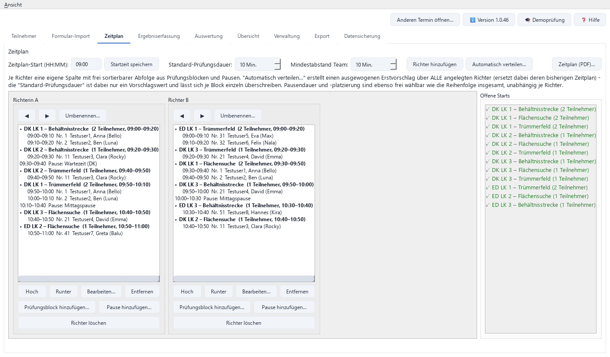

Der Zeitplan hat eine Spalte je Richter.

1. **„Zeitplan-Start (HH:MM)“** eintragen und **„Startzeit speichern“**.
2. Die beim Termin eingetragenen Richter 1–5 erscheinen beim ersten Öffnen automatisch als
   Spalten. Weitere Spalten mit **„Richter hinzufügen“** anlegen, mit **„Umbenennen…“** benennen,
   mit ◀ ▶ verschieben.
3. Entweder **„Automatisch verteilen…“** für einen ausgewogenen Vorschlag – das **ersetzt** einen
   bereits vorhandenen Plan aller Richter (dann nach Rückfrage) – oder von Hand je Richter
   **„Prüfungsblock hinzufügen…“** (Art, Leistungsklasse, Disziplin, Dauer je Teilnehmer) und
   **„Pause hinzufügen…“**. Der Vorschlag setzt Dreikampf-Teams nie gleichzeitig bei zwei
   Richtern an und hält zwischen ihren Disziplinen den **„Mindestabstand Team“** ein (Feld oben,
   Vorgabe 10 Min.). Dazu beginnen die Dreikampf-Blöcke einer Leistungsklasse mit verschiedenen
   Teams; nur wenn es nicht anders geht, fügt er eine Pause **„Wartezeit (DK)“** ein.
4. Reihenfolge mit **„Hoch“** / **„Runter“** anpassen, Dauer mit **„Bearbeiten…“** ändern.
   Start- und Endzeiten rechnet das Programm selbst. Jeder Prüfungsblock hat in der Liste eine
   fette Kopfzeile (Teilnehmerzahl und Zeitraum), die Teams stehen eingerückt darunter –
   „Hoch“, „Runter“ und „Entfernen“ wirken immer auf den ganzen Block.
   **„Pause hinzufügen…“** fügt die Pause nach der markierten Zeile ein (ohne Markierung am
   Ende). Mit **„Bei allen Richtern einfügen, um …“** entsteht dieselbe Pause, z. B. die
   Mittagspause, bei allen Richtern auf einmal – je Richter vor dem ersten Block ab dieser
   Uhrzeit, ein gerade laufender Block wird nicht geteilt. Endet der Plan eines Richters vor
   dieser Uhrzeit, steht die Pause an seinem Ende; das Programm nennt dann die tatsächlichen
   Zeiten.
5. **„Zeitplan (PDF)…“** erzeugt eine Seite je Richter.

Die Seitenleiste **„Offene Starts“** zeigt je Art/Leistungsklasse/Disziplin, ob schon ein Block
existiert (grün ✓) oder noch fehlt (rot ✗ „noch offen“).

**Überschneidungen:** Steht ein Team gleichzeitig oder mit weniger als dem Mindestabstand an zwei
Stellen – etwa nach dem Verschieben von Hand –, sind die betroffenen Zeilen rot mit ⚠ markiert
(der Tooltip nennt die andere Stelle), und oben in der Seitenleiste steht
**„⚠ Überschneidungen“** mit allen betroffenen Teams. Vor dem Zeitplan-PDF fragt das Programm
dann nach. Beheben lässt sich das durch Verschieben der Blöcke, eine Pause oder erneutes
„Automatisch verteilen…“.

> **Wichtig zu „Entfernen“:** Ein Prüfungsblock merkt sich nur Art, Leistungsklasse, Disziplin
> und Dauer. Wer darin geprüft wird, ergibt sich jedes Mal neu aus der Teilnehmerliste.
> „Entfernen“ löscht deshalb immer den **ganzen Block**. Fällt ein Teilnehmer aus, ihn im
> Reiter „Teilnehmer“ mit **„Keine Teilnahme“** markieren (siehe Kapitel 4) – nicht löschen.
> Der Zeitplan passt sich von selbst an.

## 7. Ergebniserfassung

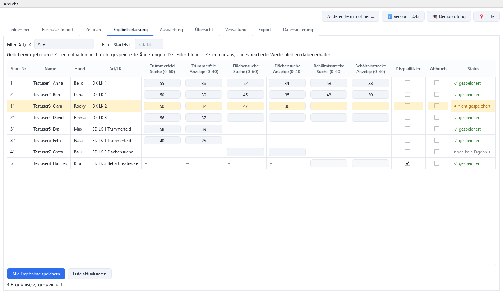

Eine Zeile je Teilnehmer, bei DK alle drei Disziplinen nebeneinander. Je Disziplin trägst du
**Suche (0-60)** und **Anzeige (0-40)** ein. Bei ED sind die anderen Disziplinen mit „–“
gesperrt.

- **Gelbe Zeilen** mit „● nicht gespeichert“ enthalten Änderungen, die noch nicht gesichert sind.
- **„Alle Ergebnisse speichern“** sichert alle Änderungen auf einmal. Speichere am Prüfungstag
  regelmäßig.
- Suche **und** Anzeige gehören zusammen. Ist nur eines der beiden Felder ausgefüllt, wird die
  Zeile nicht gespeichert: „Bitte Suche UND Anzeige eintragen oder beide Felder leer lassen.“
- **Ergebnis entfernen:** beide Felder leeren und speichern.
- **„Disqualifiziert“** bzw. **„Abbruch“** ankreuzen leert und sperrt die Punktefelder.
- Die Filter blenden nur aus, ungespeicherte Eingaben bleiben erhalten. **„Liste aktualisieren“**
  fragt vorher nach, wenn noch etwas ungespeichert ist.

Beim Wechsel des Reiters oder Termins fragt das Programm bei ungespeicherten Ergebnissen
„Jetzt speichern?“. Beim **Schließen** des Programms werden ungespeicherte Ergebnisse
automatisch gespeichert.

## 8. Auswertung und Übersicht

### Auswertung

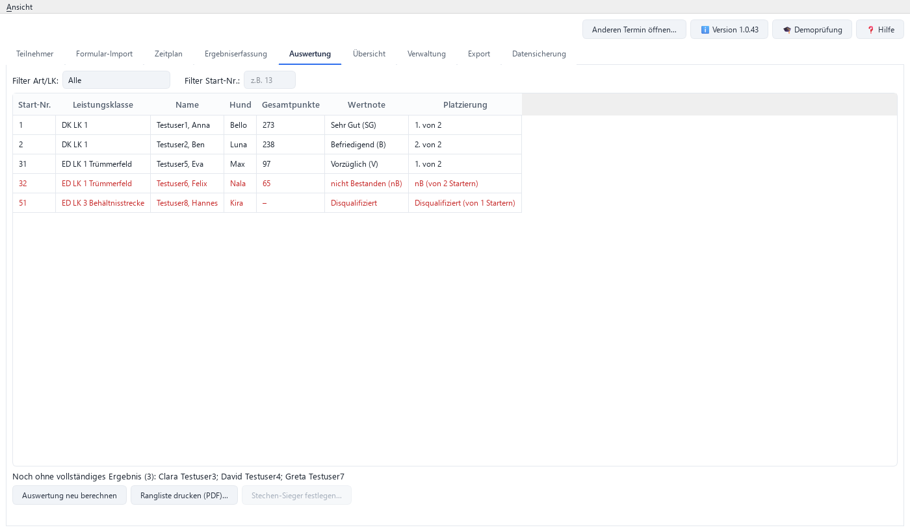

Die Rangliste je Leistungsklasse mit Gesamtpunkten, Wertnote und Platzierung („1. von 2“) wird
automatisch berechnet. **„Auswertung neu berechnen“** aktualisiert die Anzeige. Unten steht,
wer noch kein vollständiges Ergebnis hat.

„von 2“ zählt nur Starter, deren Ergebnis schon **vollständig** eingetragen ist. Sind in einer
Leistungsklasse noch Teilnehmer offen, steht unten ein Hinweis wie „Hinweis DK LK 1: „von 2“
zählt nur Starter mit vollständigem Ergebnis – 3 noch offen.“ (auch als Tooltip auf der
Platzierung und im Ergebnisliste-PDF). Sind alle eingetragen, stimmt die Zahl mit den
Startern überein.

**„Rangliste drucken (PDF)…“** speichert die Rangliste direkt als PDF. Ist im Filter eine
Art/Leistungsklasse gewählt, enthält das PDF nur diese, sonst alle. Der Filter nach
Startnummer wird dabei nicht berücksichtigt.

| Wertnote | ED (max. 100) | DK (max. 300) |
|---|---|---|
| Vorzüglich (V) | ab 96 | ab 286 |
| Sehr Gut (SG) | ab 90 | ab 270 |
| Gut (G) | ab 80 | ab 240 |
| Befriedigend (B) | ab 70 | ab 210 |

- **Bestanden** ist nur, wer in **jeder** Disziplin mindestens 70 Punkte hat – sonst
  „nicht Bestanden (nB)“, unabhängig von der Gesamtpunktzahl. In der Platzierung steht dann
  „nB (von N Startern)“.
- Punktgleiche erhalten denselben Platz, der nächste Platz wird übersprungen (1., 2., 2., 4.).
  Nicht bestanden, Disqualifiziert und Abbruch erhalten keinen Platz, zählen aber bei den
  Startern mit und erscheinen rot.
- **Stechen:** Sind mehrere punktgleich auf **Platz 1**, entscheidet ein Stechen. Bis es
  eingetragen ist, steht bei ihnen „1. (Stechen offen)“ und unten der Hinweis „Stechen nötig
  in …“. Nach dem Stechen mit **„Stechen-Sieger festlegen…“** den Sieger wählen: Er wird 1.
  („nach Stechen“), alle anderen Punktgleichen werden 2. Mit „Stechen noch offen“ lässt sich
  die Wahl zurücknehmen. Ändern sich danach die Punkte und es gibt keinen Gleichstand mehr,
  zählt die Wahl nicht mehr. Solange ein Stechen offen ist, fragt das Programm vor der
  Ergebnisliste bzw. Rangliste nach.

### Übersicht

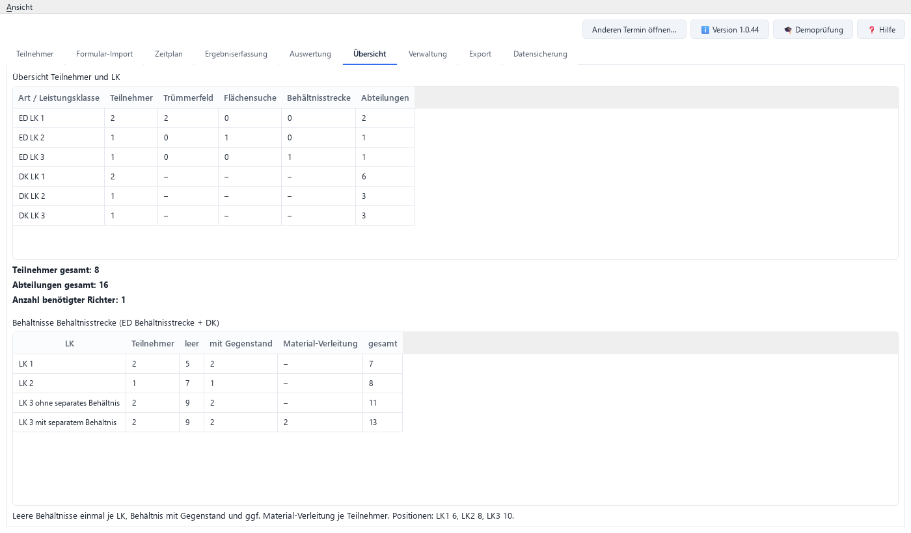

Teilnehmerzahlen je Art/Leistungsklasse und Disziplin, die Zahl der Abteilungen und die
**Anzahl benötigter Richter** (1 ED = 1 Einheit, 1 DK = 3 Einheiten, höchstens 36 Einheiten je
Richter).

Darunter zeigt die Tabelle **„Behältnisse Behältnisstrecke“**, wie viele Behältnisse je
Leistungsklasse bereitliegen müssen. Mitgezählt werden alle Teilnehmer, die die
Behältnisstrecke laufen: ED Behältnisstrecke und alle DK.

- **leer:** Positionen − 1, einmal je LK (Positionen: LK1 6, LK2 8, LK3 10)
- **mit Gegenstand:** eines je Teilnehmer
- **Material-Verleitung:** nur LK3. Die Zeile „mit separatem Behältnis“ rechnet ein eigenes
  Behältnis je Teilnehmer dazu. In der Zeile „ohne separates Behältnis“ liegt die Verleitung
  in einem der leeren Behältnisse.
- **gesamt:** Summe der Zeile

Eine LK ohne Teilnehmer zeigt überall 0. Eine Gesamtsumme über alle LK gibt es bewusst nicht,
weil die Behältnisse je LK unterschiedlich sind.

## 9. Verwaltung und Export

### Verwaltung

**„Veranstaltungsdaten bearbeiten…“** ändert Verein, Ort, Datum, Vereins-Nr., Prüfungsnummer,
Prüfungsleiter, Richter 1–5, die Prüfungsgebühren sowie Verband, Meldestelle und angebotene
Prüfungen (für das Anmeldeformular) nachträglich.

### Export

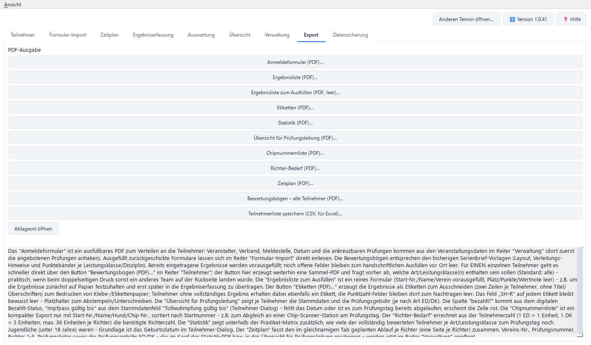

Jeder Button fragt nach dem Speicherort und erzeugt ein PDF. Vorgeschlagen wird der Ordner
`Ausdrucke\<Termin>` neben der Termin-Datei (z. B. `…\SHS-Pruefungsprogramm\Termine\Ausdrucke\2026-11-14_Verein`),
nach einem bewusst anderen Ordner dieser. Nach dem Speichern zeigt ein Fenster, wo die Datei
liegt, mit **„PDF öffnen“** und **„Ordner zeigen“** – praktisch, um sie z. B. an eine E-Mail
anzuhängen. **„Ablageort öffnen“** zeigt den Ordner jederzeit im Dateimanager (Explorer bzw. Finder).

| Button | Inhalt |
|---|---|
| **Anmeldeformular (PDF)…** | Ausfüllbares Anmeldeformular mit den Termindaten und den angebotenen Prüfungen, siehe [Kapitel 5](#5-formular-import) |
| **Ergebnisliste (PDF)…** | Rangliste mit Wertnoten je Leistungsklasse |
| **Ergebnisliste zum Ausfüllen (PDF, leer)…** | Formular mit Start-Nr./Name/Verein, Platz/Punkte/Wertnote leer – z. B. für Papier am Prüfungstag |
| **Etiketten (PDF)…** | Ergebnis-Etiketten zum Aufkleben (2 Zeilen je Teilnehmer); unvollständige Ergebnisse mit leeren Punktfeldern, Feld „SH-R“ zum Abstempeln |
| **Statistik (PDF)…** | Prädikat-Übersicht je Art/LK inkl. Jugendliche (unter 18); im Kopf Vereins-Nr., Prüfungsnummer, Richter, Prüfungsleiter |
| **Übersicht für Prüfungsleitung (PDF)…** | Stammdaten, Gebühr, bezahlt?, Impfpass gültig bis (rot bei fehlendem oder abgelaufenem Datum) |
| **Chipnummernliste (PDF)…** | Start-Nr., Name, Hund, Chip-Nr. – z. B. für den Chip-Abgleich |
| **Richter-Bedarf (PDF)…** | Berechnete Zahl benötigter Richter, darunter die Behältnisse je LK (wie im Reiter „Übersicht“) |
| **Zeitplan (PDF)…** | Eine Seite je Richter |
| **Bewertungsbögen – alle Teilnehmer (PDF)…** | Sammel-PDF aller Bewertungsbögen; vorher Auswahl der Leistungsklassen/Disziplinen. Vorhandene Ergebnisse sind vorausgefüllt. |
| **Teilnehmerliste speichern (CSV, für Excel)…** | Alle Teilnehmer mit allen Stammdaten, Startnummer, Bezahlt und „Keine Teilnahme“ – öffnet sich per Doppelklick in Excel und lässt sich auch wieder einlesen. |

Den Bewertungsbogen eines **einzelnen** Teilnehmers erzeugst du schneller im Reiter
„Teilnehmer“ mit **„Bewertungsbogen (PDF)…“**.

Ein ED-Bogen hat immer **eine** Seite, ein DK-Bogen immer **zwei** Seiten: Seite 1 mit
Trümmerfeld, Seite 2 mit Fläche, Behältnisstrecke und Gesamtergebnis. DK-Bögen kannst du
deshalb beidseitig drucken. ED-Bögen druckst du am besten einseitig, sonst steht auf der
Rückseite das nächste Team.
Zum Einzeichnen des Verstecks gibt es je Disziplin eine eigene Skizze: ein Quadrat beim
Trümmerfeld, ein Feld mit Mittelstreifen bei der Flächensuche und nummerierte Behälter bei der
Behältnisstrecke.

## 10. Datensicherung

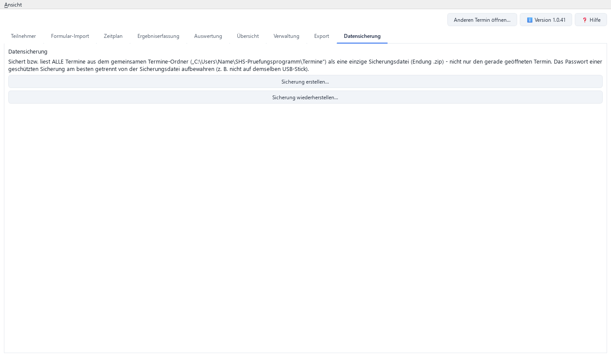

Gesichert werden immer **alle** Termine aus dem Termine-Ordner in einer einzigen
Sicherungsdatei (Endung `.zip`). Die PDFs im
Ordner „Ausdrucke“ gehören nicht dazu – sie lassen sich jederzeit neu erzeugen.

- **„Sicherung erstellen…“:** Auf Wunsch **„Mit Passwort schützen“** (die Sicherungsdatei wird dann verschlüsselt), danach
  den Speicherort wählen, z. B. einen USB-Stick. Der vorgeschlagene Dateiname enthält Datum
  und Verein des geöffneten Termins sowie den Tag der Sicherung, z. B.
  `SHS-Sicherung_2026-11-14_SGV-Koeppern-e-V_erstellt-2026-10-03.zip`. **Ein vergessenes Passwort lässt sich nicht
  wiederherstellen.** Bewahre es getrennt von der Sicherung auf.
- **„Sicherung wiederherstellen…“:** Fragt bei Bedarf nach dem Passwort. Für jeden Termin,
  den es schon gibt, wählst du **„Überschreiben“**, **„Als Kopie importieren“** oder
  **„Überspringen“**. Den gerade geöffneten Termin kann man nicht überschreiben.
  Wiederhergestellte Termine erscheinen beim nächsten „Anderen Termin öffnen…“.
  Scheitert das Wiederherstellen, bevor der erste Termin übernommen ist, bleibt alles
  unverändert. Scheitert es erst danach, zum Beispiel weil unter Windows eine Termin-Datei
  gerade in einem anderen Programm geöffnet ist, meldet das Programm **„Wiederherstellen
  unvollständig“** und nennt die Termine, die schon aus der Sicherung übernommen sind.
  Alle anderen Termine sind unverändert.

**Umzug auf einen anderen Rechner:** Auf dem alten Rechner eine Sicherung erstellen, auf dem neuen
Rechner das Programm installieren und die Sicherung wiederherstellen.

## 11. Für Richter: Ergebnisse im Browser eintragen

Bei größeren Prüfungen kann die Prüfungsleitung eine Web-Version bereitstellen. Dann trägst du
die Ergebnisse auf Tablet, Handy oder Laptop im Browser ein. Adresse, Benutzername und Passwort
bekommst du von der Prüfungsleitung.

<table>
<tr>
<td width="50%">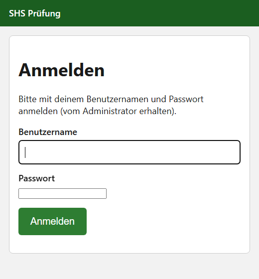</td>
<td width="50%">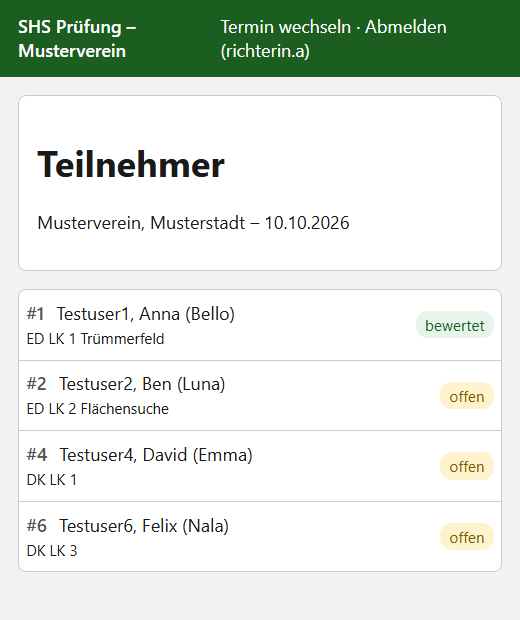</td>
</tr>
</table>

1. **Anmelden** mit Benutzername und Passwort (Groß-/Kleinschreibung beim Benutzernamen egal).
2. **Termin wählen:** Gibt es mehrere veröffentlichte Termine, den richtigen antippen. Bei nur
   einem Termin entfällt dieser Schritt.
3. **Teilnehmerliste:** Jeder Teilnehmer ist mit **„offen“** (gelb) oder **„bewertet“** (grün)
   markiert. Teilnehmer antippen.
4. **Ergebnis eintragen:** Je Disziplin **„Suchleistung (0–60)“** und
   **„Anzeigeleistung (0–40)“** eingeben und **„Speichern“** tippen. Danach geht es zurück zur
   Liste. Beide Felder einer Disziplin leeren und speichern löscht das Ergebnis.
5. **Abmelden** über den Link oben rechts. Nach 12 Stunden ohne Aktivität wirst du automatisch
   abgemeldet.

<table>
<tr>
<td width="50%">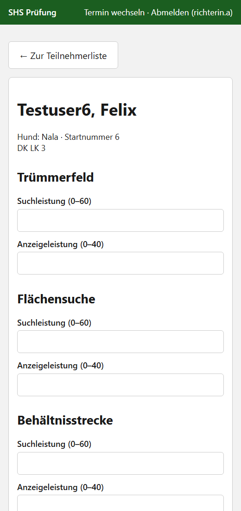</td>
<td width="50%">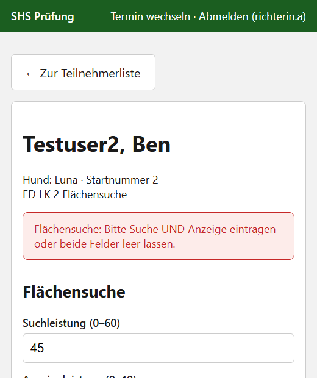</td>
</tr>
</table>

**Fehlermeldungen** erscheinen rot über dem Formular, deine Eingaben bleiben stehen:

- „Bitte bei … nur Zahlen eintragen.“
- „Suchleistung …: nur Werte von 0 bis 60 möglich.“ / „Anzeigeleistung …: nur Werte von 0 bis 40
  möglich.“
- „…: Bitte Suche UND Anzeige eintragen oder beide Felder leer lassen.“

**Gut zu wissen:**

- Beim Dreikampf können mehrere Richter **gleichzeitig** denselben Hund bearbeiten – gespeichert
  wird nur die Disziplin, die du tatsächlich geändert hast.
- **Disqualifikation und Abbruch** lassen sich im Browser nicht eintragen. Gib sie der
  Prüfungsleitung weiter; sie trägt sie im Desktop-Programm ein.

## 12. Für die Prüfungsleitung: Termin im Web veröffentlichen

Die Web-Version ist optional und braucht einen eigenen Server. Die Einrichtung beschreibt
[README_CONTAINER.md](../README_CONTAINER.md). Termin, Teilnehmer, Zeitplan und Druck bleiben im
Desktop-Programm; im Web werden nur Ergebnisse eingetragen.

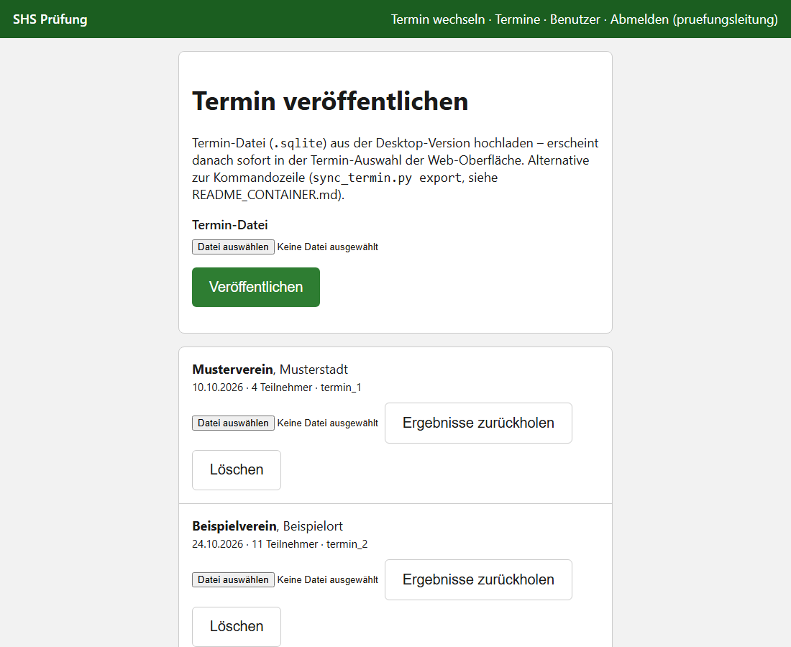

Als Administrator erreichst du oben die Seiten **„Termine“** und **„Benutzer“**.

**Benutzer anlegen:** Unter „Benutzer“ je Richter ein Konto mit der Rolle
**„Nur Eintragen (Ergebnisse erfassen)“** anlegen (Passwort mindestens 8 Zeichen).

**Vor der Prüfung – veröffentlichen:**

1. Alle Teilnehmer haben eine **Startnummer** (der Abgleich läuft darüber).
2. Unter „Termine“ bei **„Termin-Datei“** die `.sqlite`-Datei des Termins aus dem Termine-Ordner
   wählen und **„Veröffentlichen“** klicken.

**Nach der Prüfung – Ergebnisse zurückholen:**

1. **Zuerst** im Desktop-Programm alle Ergebnisse speichern und das Programm schließen (oder
   einen anderen Termin öffnen). Die zurückgeholte Datei entspricht dem Stand beim Hochladen plus
   den Web-Ergebnissen – was du danach noch im Desktop-Programm änderst, ginge beim Ersetzen
   verloren.
2. Beim Termin dieselbe `.sqlite`-Datei wählen und **„Ergebnisse zurückholen“** klicken.
3. Der Bericht zeigt, wie viele Teilnehmer aktualisiert wurden und welche Startnummern
   übersprungen oder nicht gefunden wurden.
4. Die angebotene Datei **herunterladen** – der Link funktioniert nur einmal – und damit die
   ursprüngliche Termin-Datei im Termine-Ordner ersetzen. Achte auf den Dateinamen: Der Browser
   speichert sie meist im Download-Ordner, eventuell mit Zusatz wie „(1)“. Benenne sie dann so
   um wie die ursprüngliche Datei.

Regeln beim Zurückholen: Ergebnisse werden über die **Startnummer** zugeordnet; passen Name oder
Hund nicht zusammen, wird nichts übernommen. Web-Werte überschreiben die Werte in der Datei,
im Web leere Disziplinen behalten den Wert aus der Datei. **Disqualifikation und Abbruch werden
nicht übertragen** und müssen im Desktop-Programm gesetzt werden.

## 13. Häufige Fragen und Probleme

**„Startnummer bereits vergeben“ beim Speichern eines Teilnehmers.**
Die Meldung nennt, wer die Nummer hat. Andere Nummer wählen, „Startnummer steht noch nicht fest“
ankreuzen oder in der Liste „Startnummer tauschen…“ verwenden.

**Ein Termin erscheint im Startbildschirm als „… (nicht lesbar)“, beim Öffnen kommt „Datei beschädigt“.**
Die Datei ist beschädigt oder keine Termin-Datei. Stelle den Termin aus deiner letzten
Datensicherung wieder her („Als Kopie importieren“, wenn du den Stand vergleichen willst).

**Ich habe das Passwort der Datensicherung vergessen.**
Das lässt sich nicht wiederherstellen. Erstelle eine neue Sicherung und notiere das Passwort
sicher.

**Warum ist bei ED nur ein Gegenstand eingebbar?**
Bei einer Einzeldisziplin wird nur in einer Disziplin gesucht – daher gibt es in jeder
Leistungsklasse genau einen Gegenstand (siehe [Kapitel 4](#suchgegenstände)).

**Ich sehe den Termin nach einer Wiederherstellung nicht.**
Wiederhergestellte Termine erscheinen erst beim nächsten „Anderen Termin öffnen…“.

**Kann ich auf mehreren Rechnern arbeiten?**
Ja, über die Datensicherung (siehe [Kapitel 10](#10-datensicherung)). Gleichzeitig am selben
Termin arbeiten geht mit dem Desktop-Programm nicht – dafür gibt es die Web-Version.

**Das Programm hat sich plötzlich ohne Meldung beendet.**
Bereits gespeicherte Daten bleiben erhalten. Das Programm schreibt in solchen Fällen ein
Protokoll in die Datei `absturzprotokoll.txt` im Ordner `SHS-Pruefungsprogramm` in deinem
Benutzerprofil (neben dem Ordner `Termine`). Hänge sie bitte an eine Fehlermeldung an
(siehe unten) – vorher kurz hineinschauen, ob echte Teilnehmerdaten darin stehen (auch dein
Benutzername kann in Dateipfaden vorkommen).

**Funktioniert meine Installation vollständig?**
Das Programm kann sich selbst prüfen, ohne deine Termine anzufassen. Unter Windows dazu im
Startmenü „Ausführen“ (Windows-Taste + R) öffnen und eingeben:
`"%LOCALAPPDATA%\Programs\SHS-Pruefungsprogramm\SHS-Pruefungsprogramm.exe" --selbsttest`
(bzw. den Pfad, unter dem du es installiert hast). Nach etwa einer halben Minute steht das
Ergebnis in der Datei `shs_selbsttest.log` im Temp-Ordner (Windows-Taste + R, `%TEMP%`
eingeben). Unter macOS bzw. Linux im Terminal eingeben (das Ergebnis steht dann in
`shs_selbsttest.log` in deinem Benutzerordner):

- macOS: `/Applications/SHS-Pruefungsprogramm.app/Contents/MacOS/SHS-Pruefungsprogramm --selbsttest ~/shs_selbsttest.log`
- Linux (.deb): `shs-pruefungsprogramm --selbsttest ~/shs_selbsttest.log`
- Linux (AppImage, im Ordner der Datei): `./SHS-Pruefungsprogramm-*.AppImage --selbsttest ~/shs_selbsttest.log`

„ERGEBNIS: alles OK“ heißt: Termine, Auswertung, PDFs, Formular-Import,
Datensicherung, Oberfläche und Programmsymbol funktionieren. Bei einer Fehlermeldung die Datei bitte an die
Fehlermeldung anhängen (siehe unten).

### Fehler melden oder Wunsch äußern

Bitte über die [Issues auf GitHub](https://github.com/mbruver-source/SHS/issues/new/choose) mit
den Vorlagen **„Fehler melden“** bzw. **„Idee / Wunsch“**. Hilfreich sind die Programmversion
(Button „Version“), die Schritte bis zum Fehler und ein Screenshot. **Bitte keine echten
Teilnehmerdaten** in Meldungen oder Screenshots.

## 14. Die erste Prüfung Schritt für Schritt

Dieses Kapitel begleitet dich einmal durch eine ganze Prüfung – vom ersten Start bis zur
Sicherung. Fett gedruckt ist immer genau das, was auf dem Bildschirm steht und was du
anklickst. Ein **„Reiter“** ist eine der Registerkarten oben im Programmfenster
(„Teilnehmer“, „Formular-Import“, „Zeitplan“ …) – ein Klick darauf zeigt die jeweilige Seite.

> **Tipp für den Anfang:** Schau dir zuerst die [Demoprüfung](#demoprüfung) an (Button
> **„🎓 Demoprüfung“**). Sie zeigt den ganzen Ablauf in wenigen Minuten. Danach probierst du
> alles einmal gefahrlos mit erfundenen Teilnehmern selbst aus, bevor es ernst wird (siehe
> [Ausprobieren mit Beispieldaten](#ausprobieren-mit-beispieldaten)). Den Probe-Termin
> löschst du danach einfach wieder.

### Schritt 1: Den Termin anlegen (einige Wochen vorher)

1. Programm starten. Du siehst den Startbildschirm mit der Liste deiner Termine (beim ersten
   Mal ist sie leer).
2. Auf **„Neuen Termin anlegen…“** klicken.
3. Eintragen:
   - **Austragender Verein** und **Datum** (z. B. 14.11.2026) – diese beiden sind Pflicht.
   - **Ort** – er steht später auf dem Anmeldeformular.
   - Die Namen der Richter bei **Richter 1**, **Richter 2** … – daraus entstehen später die
     Spalten im Zeitplan.
   - **Verband** und **Meldestelle** (an wen die Anmeldungen gehen, z. B. Name und E-Mail).
   - Bei **Angebotene Prüfungen** einen Haken bei jeder Prüfung setzen, die ihr anbietet.
   - Bei **Startnummern-Bereiche** je Prüfung einen Nummernbereich, z. B. DK-LK 1:
     1 bis 20. Damit verteilt das Programm später die Startnummern von selbst.
4. Den vorgeschlagenen **Speicherort** nicht ändern und auf **„OK“** klicken. Der Termin
   öffnet sich.

Alles, was du jetzt noch nicht weißt, trägst du später im Reiter **„Verwaltung“** über
**„Veranstaltungsdaten bearbeiten…“** nach.

### Schritt 2: Das Anmeldeformular verschicken

1. Reiter **„Export“** anklicken.
2. Auf **„Anmeldeformular (PDF)…“** klicken und **„Speichern“** wählen.
3. Es erscheint ein Fenster, wo die Datei liegt. Mit **„Ordner zeigen“** siehst du sie im
   Dateimanager (Explorer bzw. Finder) und kannst sie z. B. an eine E-Mail anhängen.
4. Die Teilnehmer füllen das Formular am Computer aus, speichern es und schicken es zurück.

### Schritt 3: Die Anmeldungen einlesen

Die zurückgeschickten Formulare speicherst du in einem Ordner, z. B. auf dem Desktop. Dann:

1. Reiter **„Formular-Import“** anklicken.
2. Auf **„Anmeldeformulare (PDF) importieren…“** klicken, die Dateien auswählen (mehrere auf
   einmal gehen mit gedrückter Strg-Taste) und **„Öffnen“** klicken.
3. Das Programm zeigt, was übernommen wurde und was nicht – mit Grund. Bei „nicht
   angeboten“ oder fehlenden Angaben am besten kurz beim Teilnehmer nachfragen.
4. Danach fragt das Programm, ob es die Startnummern gleich vergeben soll: **„Ja“**. (Das
   klappt, wenn du in Schritt 1 die Startnummern-Bereiche eingetragen hast.)

Kommt eine Anmeldung per Telefon, auf Papier oder als Foto, legst du den Teilnehmer von Hand
an: Reiter **„Teilnehmer“** → **„Teilnehmer hinzufügen…“** → Felder ausfüllen → **„OK“**.
Eine Liste aus Excel liest du über **„Teilnehmerliste einlesen (Excel/CSV)…“** ein (siehe
[Kapitel 5](#teilnehmerliste-aus-excel-übernehmen)). Auch danach fragt das Programm, ob es
die Startnummern gleich vergeben soll. Wer schon in der Liste steht, wird beim erneuten
Einlesen nicht doppelt angelegt.

### Schritt 4: Startnummern und Zahlungen im Blick behalten

Im Reiter **„Teilnehmer“** siehst du alle Gemeldeten.

- **Fehlt jemandem noch eine Startnummer,** auf **„Fehlende Startnummern vergeben…“** klicken.
- **Ist die Prüfungsgebühr eingegangen,** den Teilnehmer anklicken und
  **„Bezahlt umschalten“** wählen. Mehrere auf einmal markierst du mit gedrückter Strg-Taste.
- **Etwas ändern:** Doppelklick auf den Teilnehmer, ändern, **„OK“**.
- **Startnummern tauschen:** beide Teilnehmer mit gedrückter Strg-Taste markieren und
  **„Startnummer tauschen…“** klicken.
- In der Spalte **„Anmerkungen“** steht, was noch fehlt. Orange heißt: bitte vor dem
  Prüfungstag erledigen (z. B. die Chipnummer). Graue Hinweise sind nur Erinnerungen.

### Schritt 5: Den Zeitplan machen (etwa eine Woche vorher)

1. Reiter **„Zeitplan“** anklicken. Die Richter aus Schritt 1 stehen schon als Spalten da
   (sonst mit **„Richter hinzufügen“** anlegen).
2. Oben bei **„Zeitplan-Start (HH:MM)“** die Uhrzeit eintragen, z. B. 08:30, und
   **„Startzeit speichern“** klicken.
3. Auf **„Automatisch verteilen…“** klicken. Das Programm verteilt alle Teilnehmer auf die
   Richter.
4. Ist eine Zeile **rot mit ⚠**, steht ein Team zur selben Zeit an zwei Stellen. Dann die
   Blöcke mit **„Hoch“** / **„Runter“** verschieben.
5. Mittagspause: auf **„Pause hinzufügen…“** klicken, die Dauer eintragen, den Haken bei
   **„Bei allen Richtern einfügen, um“** setzen, die Uhrzeit (z. B. 12:00) eintragen und
   **„OK“** klicken. Endet der Plan eines Richters schon vorher, steht die Pause an seinem
   Ende – das Programm sagt dir dann die tatsächliche Uhrzeit. Achtung: Ein erneutes
   „Automatisch verteilen…“ ersetzt den ganzen Plan – die Pause musst du danach wieder
   einfügen.
6. Mit **„Zeitplan (PDF)…“** speichern und den Richtern schicken.

### Schritt 6: Kurz vor der Prüfung

1. Im Reiter **„Teilnehmer“** prüfen, ob die Spalte „Anmerkungen“ noch Orangenes zeigt.
2. Im Reiter **„Export“** ausdrucken:
   - **„Bewertungsbögen – alle Teilnehmer (PDF)…“** für die Richter,
   - **„Übersicht für Prüfungsleitung (PDF)…“** (wer hat bezahlt, Impfungen),
   - bei Bedarf **„Chipnummernliste (PDF)…“**.
3. Einmal eine Sicherung machen (siehe Schritt 9) – sicher ist sicher.

### Schritt 7: Am Prüfungstag

- **Jemand ist nicht gekommen:** Reiter **„Teilnehmer“** → den Teilnehmer anklicken →
  **„Keine Teilnahme“**. Bitte **nicht löschen** – so bleibt alles nachvollziehbar.
- **Ergebnisse eintragen:** Reiter **„Ergebniserfassung“**. In der Zeile des Teilnehmers je
  Disziplin bei **„Suche“** (0 bis 60) und **„Anzeige“** (0 bis 40) die Punkte eintippen.
  Bei einer Disqualifikation den Haken **„Disqualifiziert“** setzen.
- **Speichern:** Gelbe Zeilen sind noch nicht gespeichert. Klicke regelmäßig auf
  **„Alle Ergebnisse speichern“** (oder drücke **Strg+S**).

### Schritt 8: Nach der Prüfung

1. Reiter **„Auswertung“**: Hier steht die Rangliste mit Punkten, Wertnote und Platz.
2. Reiter **„Export“**: **„Ergebnisliste (PDF)…“**, **„Etiketten (PDF)…“** (zum Aufkleben in
   die Leistungshefte) und **„Statistik (PDF)…“** speichern und drucken.

### Schritt 9: Sichern

1. Reiter **„Datensicherung“** → **„Sicherung erstellen…“**.
2. Auf Wunsch **„Mit Passwort schützen“** ankreuzen und ein Passwort zweimal eingeben.
   Schreib es dir auf und bewahre es **nicht** zusammen mit dem USB-Stick auf – ein
   vergessenes Passwort kann niemand wiederherstellen.
3. Als Speicherort z. B. den USB-Stick wählen und **„Speichern“** klicken.

Geschafft! Wenn unterwegs etwas nicht klappt, hilft [Kapitel 13](#13-häufige-fragen-und-probleme)
oder der Button **„❓ Hilfe“** oben rechts im Programm.

## 15. Glossar: Wörter kurz erklärt

| Wort | Bedeutung |
|---|---|
| **Abbruch (Abbr.)** | Die Prüfung wurde abgebrochen. Kein Platz und keine Punkte, das Team zählt aber bei „von x“ mit. |
| **Ablageort / Ordner „Ausdrucke“** | Der Ordner, in dem das Programm deine PDFs vorschlägt: `Termine\Ausdrucke\<Termin>`. |
| **Anmerkungen** | Spalte im Reiter „Teilnehmer“, die zeigt, was bei einem Teilnehmer noch fehlt. |
| **Behältnisstrecke, Flächensuche, Trümmerfeld** | Die drei Suchdisziplinen. |
| **Chip-Nr.** | Die Nummer des Mikrochips des Hundes, um ihn am Prüfungstag eindeutig zu erkennen. |
| **CSV-Datei** | Eine einfache Tabellendatei. Excel kann sie öffnen und speichern („Speichern unter“ → „CSV“). |
| **Disqualifiziert (Disq./DISQ)** | Das Team wurde von der Prüfung ausgeschlossen. Kein Platz und keine Punkte, das Team zählt aber bei „von x“ mit. |
| **DK (Dreikampf)** | Der Hund wird in allen drei Disziplinen geprüft. |
| **ED (Einzeldisziplin)** | Der Hund wird nur in einer Disziplin geprüft. |
| **Gegenstand / „gesucht in“** | Der Gegenstand, den der Hund suchen soll, und die Disziplin, in der er versteckt wird. |
| **KI / Prompt** | KI ist ein Programm wie ChatGPT oder Claude. Der „Prompt“ ist der Text, den du dort hineinkopierst, damit die KI Formulare in eine Liste umwandelt. Nur nötig, wenn du diesen Weg nutzt. |
| **LK (Leistungsklasse)** | Die Schwierigkeitsstufe 1, 2 oder 3. |
| **Markieren** | Eine Zeile anklicken. Mehrere Zeilen: mit gedrückter Strg-Taste nacheinander anklicken. |
| **Meldestelle** | Wer die Anmeldungen entgegennimmt – steht auf dem Anmeldeformular. |
| **nB (nicht bestanden)** | Mindestens eine Disziplin hat weniger als 70 Punkte. |
| **OMA** | Online-Meldeannahme – die Internetseite, über die Teilnehmer sich auch melden können. Ihre Meldungsliste kann das Programm einlesen. |
| **PDF** | Eine Datei zum Ansehen und Drucken, die überall gleich aussieht. |
| **Prüfungsblock** | Im Zeitplan alle Teams einer Prüfung (z. B. „ED LK 1 Trümmerfeld“) bei einem Richter. |
| **Reiter** | Die Registerkarten oben im Programmfenster („Teilnehmer“, „Zeitplan“ …). |
| **SH-R** | Spürhundesport-Richter. Das Feld „SH-R“ auf den Etiketten ist für seinen Stempel. |
| **Sicherungsdatei** | Eine Datei (Endung `.zip`), in der alle Termine stecken – zum Aufbewahren, z. B. auf einem USB-Stick. |
| **Stechen** | Entscheidet bei Punktgleichheit auf Platz 1, wer gewinnt. Den Sieger trägst du im Reiter „Auswertung“ ein. |
| **Starter / „1. von 2“** | „von 2“ zählt die Teams einer Leistungsklasse, deren Ergebnis schon vollständig eingetragen ist. |
| **Startnummern-Bereich** | Welche Startnummern zu welcher Prüfung gehören, z. B. 1 bis 20 für DK LK 1. |
| **Termin / Termin-Datei** | Eine Prüfung mit allen Teilnehmern und Ergebnissen. Jede Prüfung ist eine eigene Datei. |
| **Tooltip** | Ein kleiner Hilfetext, der erscheint, wenn du die Maus kurz über etwas hältst. |
| **Verschlüsselt / Passwort** | Eine Sicherung mit Passwort kann nur öffnen, wer das Passwort kennt. |
| **Web-Version** | Eine zusätzliche, freiwillige Möglichkeit, dass Richter Ergebnisse im Browser eintragen. Für eine normale Prüfung nicht nötig. |
| **Wertnote** | Das Prädikat nach Punkten: Vorzüglich, Sehr Gut, Gut, Befriedigend. |
